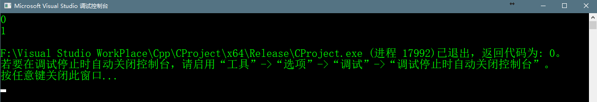
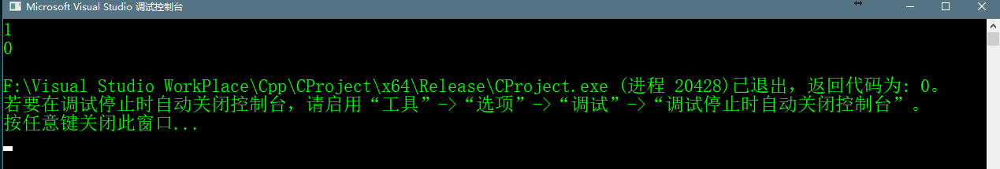

# 1.Two Sum


## 题目
> Given an array of integers, return **indices** of the two numbers such that they add up to a specific target.  
> 
> You may assume that each input would have **exactly** one solution, and you may not use the same element twice.
> 
> ### Example:
> 
> Given nums = [2, 7, 11, 15], target = 9,
> 
> Because nums[0] + nums[1] = 2 + 7 = 9,
> return [0, 1].

## 题目翻译
> 给定一个整数数组和一个指定的数组其中某两个数相加的和，返回该两个数的**下标**。  
> 可以假定每个输入有且只有一个解决方案，数组中同一个元素不会用两次。


## 方法一
> 此题难度较低，看到题目能想到一个直观的解决方案，就是双层循环的嵌套，先判断两个元素不是同一个元素，然后两个数相加，如果
> 和等于给定的目标值，则把这两个数的下标添加到vector中。这个方法的时间复杂度为O(n²)，空间复杂度为O(1)。代码如下：

```c++
    std::vector<int> returnVector;
    vector<int> twoSum(vector<int>& nums, int target) {
        for(int i = 0;i < nums.size();i++){
            for(int j = 0;j < nums.size();j++){
                if(nums[i] != nums[j]){
                    if(nums[i] + nums[j] == target){
                        returnVector.push_back(i);
                        returnVector.push_back(j);
                        return returnVector;
                    }
                }
            }
        }
        returnVector.push_back(-1);
        returnVector.push_back(-1);
        return returnVector;
    }
```

## 完整代码如下所示
```c++
#include<iostream>
#include<vector>
#include<unordered_map>

using namespace std;

class TwoSum {
private:
	std::vector<int> returnVector;
public:
	vector<int> twoSum(vector<int>& nums, int target) {
		for (int i = 0; i < nums.size(); i++) {
			for (int j = 0; j < nums.size(); j++) {
				if (nums[i] != nums[j]) {
					if (nums[i] + nums[j] == target) {
						returnVector.push_back(i);
						returnVector.push_back(j);
						return returnVector;
					}
				}
			}
		}
		returnVector.push_back(-1);
		returnVector.push_back(-1);
		return returnVector;
	}
};

int main() {
	vector<int> nums{2,7,11,15};
	int target = 9;
	TwoSum twoSum;
	vector<int> solution = twoSum.twoSum(nums, target);
	//使用迭代器对vector对象和循环进行访问
	vector<int>::iterator it;
	for (it = solution.begin(); it < solution.end(); it++)
	{
		cout << *it << endl;
	}
}
```
## 程序运行的结果



## 方法二
> 上述的方案是最为直观的，但是这样使用蛮力的方法往往不是最好的。为了改善我们运行的时间复杂度，我们需要用更加有效的方式检查互补数(即
> target - nums[i]，命名为complement)，如果completment存在于给定的nums[i]中，并且该complement不等于给定的数组nums中的任意一个数
> 则说明该nums[i]下标i和给定的数组nums中等于complement的下标为该函数的返回值。  
> 我们需要查找数组的下标，用什么样的方式把数组的每个元素都存下并且和它的下标对应呢，并且还要有快速查找的功能，那就是Hash Table。
> 我们以空间换取速度，把查找时间从O(n)减少到了O(1)。Hash Table的查找时间几乎接近常数时间，但是如果发生了冲突的时候，此时的查找时间可能
> 会衰减到O(n)，但是只要我们仔细地挑选hash方法，就能够避免这样的情况发生。
> 使用两个迭代就能很简单的实现上面的思路。在第一个迭代中，我们把给定的数组nums的所有的值和下标都添加的hash table中。然后在下一个迭代中
> 我们检查每个元素的complement(complement = target - nums[i])，如果complement存在于上面hash table中，并且complement与nums[i]
> 不是相等的（或者说不是同一个数）。那么数组下标i和在给定数组中等于complement那个数的下标为目标值。方法代码如下：

```c++
    vector<int> twoSum2(vector<int>& nums, int target) {
		unordered_map<int, int> u_map;
		vector<int> result;
		for (int i = 0; i < nums.size(); i++)
		{
			if (u_map.count(target - nums[i]))
			{
				result.push_back(i);
				result.push_back(u_map[target - nums[i]]);
				return result;
			}
			else u_map[nums[i]] = i;
		}
		return result;
	}
```
## 程序完整代码如下

```c++
    #include<iostream>
    #include<vector>
    #include<unordered_map>

    using namespace std;

    class TwoSum {
    private:
    	std::vector<int> returnVector;
    public:
    	vector<int> twoSum2(vector<int>& nums, int target) {
    		unordered_map<int, int> u_map;
    		vector<int> result;
    		for (int i = 0; i < nums.size(); i++)
    		{
    			if (u_map.count(target - nums[i]))
    			{
    				result.push_back(i);
    				result.push_back(u_map[target - nums[i]]);
    				return result;
    			}
    			else u_map[nums[i]] = i;
    		}
    		return result;
    	}

    };

    int main() {
    	vector<int> nums{2,7,11,15};
    	int target = 9;
    	TwoSum twoSum;
    	vector<int> solution = twoSum.twoSum2(nums, target);
    	//使用迭代器对vector对象和循环进行访问
    	vector<int>::iterator it;
    	for (it = solution.begin(); it < solution.end(); it++)
    	{
    		cout << *it << endl;
    	}
    }
```

## 程序运行结果如下




