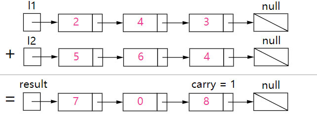

# 2.Add Two Numbers

## 题目
> You are given two non-empty linked lists representing two non-negative integers. The digits are stored in reverse order and each of their nodes contain a single digit. Add the two numbers and return it as a linked list.
> 
> You may assume the two numbers do not contain any leading zero, except the number 0 itself.
> 
> Example:
> 
> Input: (2 -> 4 -> 3) + (5 -> 6 -> 4)
> Output: 7 -> 0 -> 8
> Explanation: 342 + 465 = 807.

## 题目翻译
> 给定两个非空Linked List表示两个非负整数，每个数字以倒置的方式单独的存储在每个节点中。让两个数字相加使其返回一个新的Linked List。

## 思路
就像在纸张上列竖式计算一样，从最后一个数字开始加起，然后如果超过了10，则保留下取余10后数，然后进位为1，待到下一位两个数字相加的时候，
然后加上这个进位，之后的数字也以此类推。342 + 465 = 807。把这个过程可以用下图进行表示。

