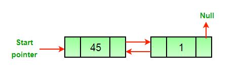
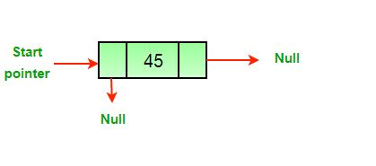
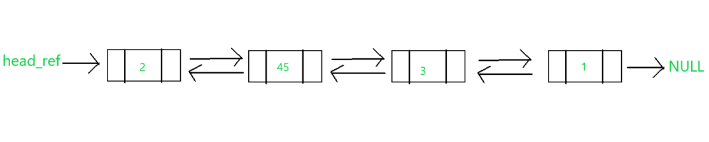
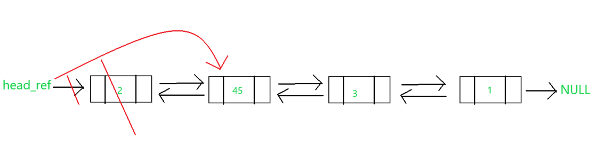
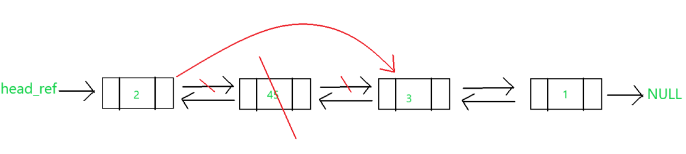
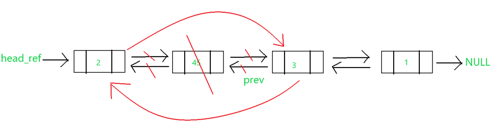
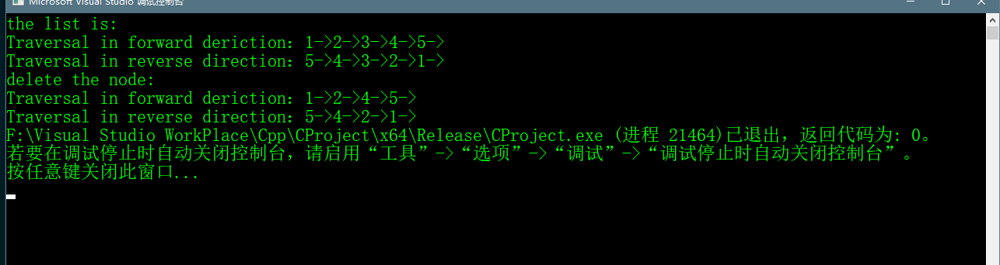

# Delete a node in DLL

>初始化DLL之后，DLL的结构如下图所示
>
>

> 删去头结点后的DLL
> 
> 

>再去删去一个节点后的DLL
>
>

> 只剩下最后一个节点
> 
> 

## 解决思路
> 传入要删除的节点del
>1. 如果要删去的节点是的头结点，则将 头指针指向头结点的next指针指向的元素
>2. 如果del的next指针指向的节点存在，则将 del的next指针指向的节点的prev指针指向del的prev指向的节点
>3. 如果del的prev指针指向节点存在，则将 del的prev指针指向的节点的next指针指向del的next指向的节点

## 部分代码

```c++
    void deleteNode(Node ** head_ref, Node * del)
    {

    	if (*head_ref == NULL || del == NULL) {
    		return;
    	}

    	//if node to be deleted is head node
    	if (*head_ref == del)
    	{
    		*head_ref = del->next;
    	}

        //if node to be deleted is not the first node chage prev
    	if (del->prev != NULL)
    	{
    		del->prev->next = del->next;
    	}
    	
    	//if node to be deleted is not last node change next
    	if (del->next != NULL)
    	{
    		del->next->prev = del->prev;
    	}

    	//finally,free the memory occupied by del
    	free(del);
    	return;
    }
```

## 图解
### 如果DLL为空，则退出方法

### ① 初始DLL


### ② 如果删除为头结点


### ③ 如果删除不是头结点
##### i. 如果要删去节点下一个节点不为空，则将 要被删去节点的上一个节点的next指针，指向要被删去节点下一个节点。如下图



##### ii. 如果要删去节点的上一个节点不为空，则将 要被删去节点的下一个节点的prev指针，指向要被删去节点的上一个节点。如下图


### ④ 释放要删除节点的内存空间 


## 完整代码

```c++
    #include<iostream>
    #include<cstdlib>
    #include<cstdio>

    using namespace std;

    //insert a new node on the front of the list
    void push(struct Node** head_ref, int data);
    //print the content of the list
    void printList(struct Node* head);
    //delete a node in DLL
    void deleteNode(struct Node** head_ref, struct Node* del);

    struct  Node
    {
    	int data;
    	struct Node* next;
    	struct Node* prev;
    };

    void printList(struct Node* head) {
    	struct Node* head_node = head;
    	//指向尾节点的指针
    	struct Node* last_node = NULL;
    	//正向打印
    	printf("Traversal in forward deriction：");
    	while (head_node != NULL)
    	{
    		printf("%d->", head_node->data);
    		//这条语句要写在这里不能写在下面那条语句之后，因为最后一次执行循环完之后的head_node的next
    		//指针指向的是NULL，last_node如果写在之后将是NULL
    		last_node = head_node;
    		head_node = head_node->next;
    	}
    	printf("\n");
    	//逆向打印
    	printf("Traversal in reverse direction：");
    	while (last_node != NULL)
    	{
    		printf("%d->", last_node->data);
    		last_node = last_node->prev;
    	}
    }

    void push(struct Node** head_ref, int newData) {
    	//1.allocae memory
    	struct Node* new_node = (struct Node*)malloc(sizeof(struct Node));
    	int size = sizeof(struct Node);
    	//2.put int the data
    	new_node->data = newData;
    	//3. make the next of new node as head and previous as NULL
    	new_node->next = *head_ref;
    	new_node->prev = NULL;

    	//4.change prev of head node to new node
    	if ((*head_ref) != NULL)
    	{
    		(*head_ref)->prev = new_node;
    	}

    	//5.move the head to point to the new node
    	*head_ref = new_node;
    }

    int main() {

    	struct Node* head = NULL;
    	push(&head, 5);
    	push(&head, 4);
    	push(&head, 3);
    	push(&head, 2);
    	push(&head, 1);
    	printf("the list is:\n");
    	printList(head);

    	printf("\n");
    	deleteNode(&head, head->next->next);
    	printf("delete the node:\n");
    	printList(head);

    }

    void deleteNode(Node ** head_ref, Node * del)
    {

    	if (*head_ref == NULL || del == NULL) {
    		return;
    	}

    	//if node to be deleted is head node
    	if (*head_ref == del)
    	{
    		*head_ref = del->next;
    	}

    	//if node to be deleted is not last node change next
    	if (del->next != NULL)
    	{
    		del->next->prev = del->prev;
    	}
    	//if node to be deleted is not the first node chage prev
    	if (del->prev != NULL)
    	{
    		del->prev->next = del->next;
    	}

    	//finally,free the memory occupied by del
    	free(del);
    	return;
    }

```

## 代码运行效果


