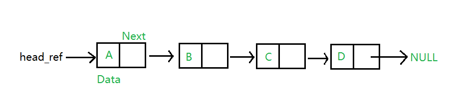

# 1 Introduction


## 什么是Linked List  
  
  
>    Linked List就像是数组一样，Linked List是一个线性的数据结构。与数组不同的是，Linked List不是存储
在连续的位置，元素之间使用指针连接。 如下图所示就是一个Linked List。
> ###### LinkedList示意图：
>
  
    
    
## 为什么使用Linked List
 *  数组常常用来存储线性结构，但是数组有着以下几点缺点
     * 数组的大小是固定的，我们必须预先知道元素的上限是多少，并且可能分配多了。
     *  在一个数组中插入一个新的元素的代价十分的大，因为在为新元素创建空间同时，必须要对现有的元素进行移位操作。
    
> 例如我们将在一个排好序的数组中插入一个元素  
> array = {1001,1002,1003,1005,1006};  
> 如果我们要在1003的位置之后中插入一个1004并且保持一个已排序的状态，那么我们不得不在插入一个1004之后然后  
> 移动1005和1006。如此一来就增加了不少的花销。
> 


# Linked List的优点
>  * 元素个数的动态的
>  * 便于插入和删除

# Linked List的缺点
> 1. 不允许随机访问，我们不得不通过头结点通过顺序遍历元素。
> 2. Linked List的每个元素都需要的额外内存空间用来保存指向下一个元素的指针。
> 3. Linked List没有缓存，由于数组是连续内存存储，所以数组下标就是数组的缓存，而Linked List没有。


# Linked List的表示
> 链表由指向链表的第一个节点的指针表示。第一个节点称为头节点(head)。如果链表为空，
> 则head的值为NULL。
> ## Linked List的组成
> Linked List由两部分组成  
> * 数据  
> * 指向下一个节点的指针
> 在C语言中，我们可以使用Node结构体来定义一个Linked List

> ```c++
>   // A Linked List node
>   struct Node 
>   { 
>        int data; 
>       struct Node *next; 
>    }; 

# 完整代码
```cpp
       // a linked list 
       #include<stdio.h> 
       #include<stdlib.h> 
        struct Node  
        { 
          int data; 
          struct Node *next; 
        }; 
          
        // 程序用于创建一个只有三个Node的简单Linked List
        int main() 
        { 
          struct Node* head = NULL; 
          struct Node* second = NULL; 
          struct Node* third = NULL; 
            
          // allocate 3 nodes in the heap   
          head = (struct Node*)malloc(sizeof(struct Node));  
          second = (struct Node*)malloc(sizeof(struct Node)); 
          third = (struct Node*)malloc(sizeof(struct Node)); 
          
          /* 动态的分配了3个存储区域.  
             We have pointers to these three blocks as first, 
             second and third      
               head           second           third 
                |                |               | 
                |                |               | 
            +---+-----+     +----+----+     +----+----+ 
            | #  | #  |     | #  | #  |     |  # |  # | 
            +---+-----+     +----+----+     +----+----+ 
          head->data = 1;      //assign data in first node 
          head->next = second; // Link first node with  
                               // the second node 
            
          /* 数据data被赋值为1，并且next指针指向了second节点
               head          second         third 
                |              |              | 
                |              |              | 
            +---+---+     +----+----+     +-----+----+ 
            | 1  | o----->| #  | #  |     |  #  | #  | 
            +---+---+     +----+----+     +-----+----+     
          */  
            
          // 对second节点赋值  
          second->data = 2;  
          
          // Linked List的第二个节点的next指针指向了third
          second->next = third; 
          
               head         second         third 
                |             |             | 
                |             |             | 
            +---+---+     +---+---+     +----+----+ 
            | 1  | o----->| 2 | o-----> |  # |  # | 
            +---+---+     +---+---+     +----+----+      */    
            
          third->data = 3; //assign data to third node 
          third->next = NULL; 
            
          /* 将第三个节点的data赋值为3，将其next指针赋值为NULL，
          则Linked List在此结束  
             Linked List已经完成   
                   head     
                     | 
                     |  
                +---+---+     +---+---+       +----+------+ 
                | 1  | o----->|  2  | o-----> |  3 | NULL | 
                +---+---+     +---+---+       +----+------+    */    
                
          return 0; 
        } 
```
