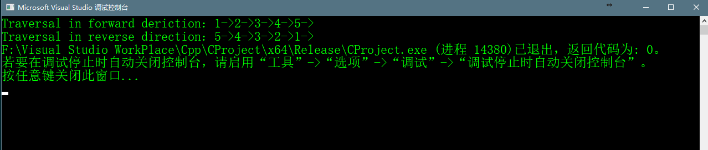
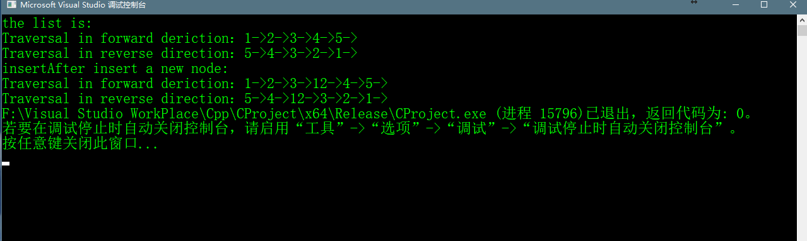
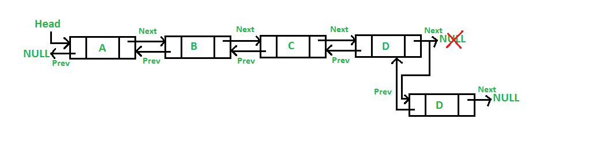
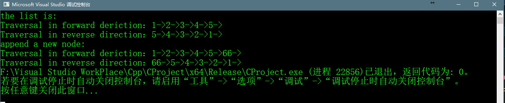

# Introduction


## Abstract

> A Double Linked List(DLL)包含了一个额外的指针，通常称为previous指针，和next指针和数据域data一并的存在于单链表Linked List中。
> 如下图所示：

> 

>用c语言代码来表示一个双链表的节点的如下
 
```c++
    struct Node{
        int data;
        struct Node* next;
        struct Node* prev;
    }
```
## 以下是Doubly Linked List和Singly Linked List相比的优点和缺点

### 与Singly Linked List相比的优点
>1. Doubly Linked List能够直接的向前遍历和向后遍历
>2. 如果事先给定了要被删除节点的指针则DLL的删除操作将会更有效
>3. 我们能够在给定的一个链表中快速的插入一个新节点，在一个单链表中，如果删除一个节点，则需要一个指向前面的指针。为了
>得到这样一个指向前节点的指针，我们往往需要通过遍历的方式。在DLL中，我们只需要使用previous指针就能获得指向前一个节点的指针。


### 与Singly Linked List相比的劣势
>1. 每个节点需要额外的空间存放的previous指针(可以用单链表实现Doubly Linked List，后面章节介绍)
>2. 所有的操作都需要的维护一个额外的指针。例如在插入操作的时候，我们需要和next指针一样也要去更改previous指针。
>这样就使得需要额外的几个步骤用于操作previous指针。


## 插入操作
>一个节点能够有四种方式插入到DLL中
>1. 插入在DLL的最前面
>2. 插入在给定节点的后面
>3. 插入在DLL的最后面
>4. 插入在给定节点之前

## 1. 插入在DLL的最前面
> 完成插入到DLL最前面需要五个步骤
> 我们如果给定了节点为10->15->25->20，如果我们要添加一个节点5在前端，那么此时链表将成为5->10->15->25->20。
> 和Singly Linked  List类似，也把DLL插入节点到最前端的方法称为push，该push方法同样的也接收一个参数，该参数为DLL
> 的指向头结点的指针，因为push方法一定要改变头的节点使其指向新的节点。如下图所示：
> 
> 

## 以下为插入的五个步骤
### ① 分配新节点的内存空间
### ② 使新节点data为指定的值
### ③ 使新节点的next指向原来的DLL的头节点，并且使新节点的prev指向NULL
### ④ 如果传入的指向头节点不为NULL，则是传入的头结点的prev指针指向新节点
### ⑤ 使指向头结点的指针指向新节点

## 部分代码如下

```c++
    void push(struct Node** head_ref, int data) {
	//1.allocae memory
	struct Node* new_node = (struct Node*)malloc(sizeof(struct Node*));

	//2.put int the data
	new_node->data = data;
	//3. make the next of new node as head and previous as NULL
	new_node->next = *head_ref;
	new_node->prev = NULL;
	
	//4.change prev of head node to new node
	if ((*head_ref) != NULL)
	{
		(*head_ref)->prev = new_node;
	}
	
	//5.move the head to point to the new node
	*head_ref = new_node;
}
```

## 完整代码如下
```c++
    #include<iostream>
    #include<cstdlib>
    #include<cstdio>

    using namespace std;

    //insert a new node on the front of the list
    void push(struct Node** head_ref, int data);
    //print the content of the list
    void printList(struct Node* head);

    struct  Node
    {
    	int data;
    	struct Node* next;
    	struct Node* prev;
    };

    void printList(struct Node* head) {
    	struct Node* head_node = head;
    	//指向尾节点的指针
    	struct Node* last_node = NULL;
    	//正向打印
    	printf("Traversal in forward deriction：");
    	while (head_node != NULL)
    	{
    		printf("%d->", head_node->data);
    		//这条语句要写在这里不能写在下面那条语句之后，因为最后一次执行循环完之后的head_node的next
    		//指针指向的是NULL，last_node如果写在之后将是NULL
    		last_node = head_node;
    		head_node = head_node->next;
    	}
    	printf("\n");
    	//逆向打印
    	printf("Traversal in reverse direction：");
    	while (last_node != NULL)
    	{
    		printf("%d->", last_node->data);
    		last_node = last_node->prev;
    	}
    }
       

    void push(struct Node** head_ref, int newData) {
    	//1.allocae memory
    	struct Node* new_node = (struct Node*)malloc(sizeof(struct Node));

    	//2.put int the data
    	new_node->data = newData;
    	//3. make the next of new node as head and previous as NULL
    	new_node->next = *head_ref;
    	new_node->prev = NULL;
    	
    	//4.change prev of head node to new node
    	if ((*head_ref) != NULL)
    	{
    		(*head_ref)->prev = new_node;
    	}
    	
    	//5.move the head to point to the new node
    	*head_ref = new_node;
    }

    int main() {

    	struct Node* head = NULL;
    	push(&head, 5);
    	push(&head, 4);
    	push(&head, 3);
    	push(&head, 2);
    	push(&head, 1);

    	printList(head);
    }
    
```

## push方法运行结果如下



## 2. 插入在给定节点的后面
> 我们给定指向某个节点的指针，插入一个新节点在这个节点之后。如下图所示：

>   

> 步骤如下：
> ### ① 检查给定的节点的指针，判断是否为NULL，为NULL则返回
> ### ② 为新节点分配内存空间
> ### ③ 把新节点的值赋值于新节点的data域
> ### ④ 将新节点的next指针指向给定节点next指针所指向节点
> ### ⑤ 将给定节点的next指针指向新节点
> ### ⑥ 将新节点的prev指针指向给定的节点
> ### ⑦ 如果新节点的next指针指向节点不为NULL，则指向的节点的prev指针指向新节点

## 部分代码如下
```c++
    void insertAfter(Node * node, int newData)
    {
    	//1.check if the given node is NULL
    	if (node == NULL)
    	{
    		printf("the given previous node cannot be NULL");
    		return;
    	}
    	//2.allocate new node
    	struct Node* new_node = (struct Node*)malloc(sizeof(struct Node));
    	//3.put int the data

    	new_node->data = newData;
    	//4.make the next of new node as next of given node
    	new_node->next = node->next;
    	//5.make the next of node as new node
    	node->next = new_node;
    	//6.make node as previous of new node 
    	new_node->prev = node;
    	//7.change previous of new node's next node
    	if (new_node->next != NULL) {
    		new_node->next->prev = new_node;
    	}
    }
```
## 完整代码如下
```c++
    #include<iostream>
    #include<cstdlib>
    #include<cstdio>

    using namespace std;

    //insert a new node on the front of the list
    void push(struct Node** head_ref, int data);
    //print the content of the list
    void printList(struct Node* head);
    //insert a new node after the given list
    void insertAfter(struct Node* node,int new_data);

    struct  Node
    {
    	int data;
    	struct Node* next;
    	struct Node* prev;
    };

    void printList(struct Node* head) {
    	struct Node* head_node = head;
    	//指向尾节点的指针
    	struct Node* last_node = NULL;
    	//正向打印
    	printf("Traversal in forward deriction：");
    	while (head_node != NULL)
    	{
    		printf("%d->", head_node->data);
    		//这条语句要写在这里不能写在下面那条语句之后，因为最后一次执行循环完之后的head_node的next
    		//指针指向的是NULL，last_node如果写在之后将是NULL
    		last_node = head_node;
    		head_node = head_node->next;
    	}
    	printf("\n");
    	//逆向打印
    	printf("Traversal in reverse direction：");
    	while (last_node != NULL)
    	{
    		printf("%d->", last_node->data);
    		last_node = last_node->prev;
    	}
    }

    void push(struct Node** head_ref, int newData) {
    	//1.allocae memory
    	struct Node* new_node = (struct Node*)malloc(sizeof(struct Node));
    	int size = sizeof(struct Node);
    	//2.put int the data
    	new_node->data = newData;
    	//3. make the next of new node as head and previous as NULL
    	new_node->next = *head_ref;
    	new_node->prev = NULL;
    	
    	//4.change prev of head node to new node
    	if ((*head_ref) != NULL)
    	{
    		(*head_ref)->prev = new_node;
    	}
    	
    	//5.move the head to point to the new node
    	*head_ref = new_node;
    }

    int main() {

    	struct Node* head = NULL;
    	push(&head, 5);
    	push(&head, 4);
    	push(&head, 3);
    	push(&head, 2);
    	push(&head, 1);
    	printf("the list is:\n");
    	printList(head);

    	printf("\n");

    	printf("insertAfter insert a new node:\n");
    	insertAfter(head->next->next, 12);
    	printList(head);

    }

    void insertAfter(Node * node, int newData)
    {
    	//1.check if the given node is NULL
    	if (node == NULL)
    	{
    		printf("the given previous node cannot be NULL");
    		return;
    	}
    	//2.allocate new node
    	struct Node* new_node = (struct Node*)malloc(sizeof(struct Node));
    	//3.put int the data

    	new_node->data = newData;
    	//4.make the next of new node as next of given node
    	new_node->next = node->next;
    	//5.make the next of node as new node
    	node->next = new_node;
    	//6.make node as previous of new node 
    	new_node->prev = node;
    	//7.change previous of new node's next node
    	if (new_node->next != NULL) {
    		new_node->next->prev = new_node;
    	}
    }

```

## 运行结果如下




## 3.插入在DLL的最后面
> 新节点常常要添加再给定链表的最后，我们常常把这个方法称为append。例如我们的创建的链表是A->B->C->D。如果想要添加一个
> 节点D到最后，则调用append方法后为使得链表成为A->B->C->D->D。示意图如下：

>
>## 步骤如下  
>### ① 分配新节点的内存
>### ② 将值赋予新节点的data数据域
>### ③ 因为添加在链表的最后，所以新节点的next指针指向NULL
>### ④ 如果链表为NULL，则使得头指针指向该新节点
>### ⑤ 将链表遍历到最后一个节点，获得该指向最后一个节点的指针
>### ⑥ 将最后一个节点的next指针指向新节点
>### ⑦ 将新节点(现在的最后一个节点)的prev指针指向原先的最后节点

## 部分代码如下：
```c++
    void append(Node **head_ref, int new_data)
    {
    	//1.allocate new node
    	struct Node* new_node = (struct Node*)malloc(sizeof(struct Node));
    	//2.put in the data 
    	new_node->data = new_data;

    	//3.next of new node is NULL
    	new_node->next = NULL;
    	//if list is empty,then make the new node as head
    	if (*head_ref == NULL)
    	{
    		new_node->prev = NULL;
    		*head_ref = new_node;
    	}
    	//5. else traverse the list and get last node
    	struct Node* last = *head_ref;
    	while (last->next != NULL)
    	{
    		last = last->next;
    	}
    	//6. chage the next of the last node
    	last->next = new_node;
    	//7.make last node as previous of new node
    	new_node->prev = last;
    }
```

## 完整代码如下

```c++
    #include<iostream>
    #include<cstdlib>
    #include<cstdio>

    using namespace std;

    //insert a new node on the front of the list
    void push(struct Node** head_ref, int data);
    //print the content of the list
    void printList(struct Node* head);
    //add a new node in the end
    void append(struct Node** head_ref, int new_data);

    struct  Node
    {
    	int data;
    	struct Node* next;
    	struct Node* prev;
    };

    void printList(struct Node* head) {
    	struct Node* head_node = head;
    	//指向尾节点的指针
    	struct Node* last_node = NULL;
    	//正向打印
    	printf("Traversal in forward deriction：");
    	while (head_node != NULL)
    	{
    		printf("%d->", head_node->data);
    		//这条语句要写在这里不能写在下面那条语句之后，因为最后一次执行循环完之后的head_node的next
    		//指针指向的是NULL，last_node如果写在之后将是NULL
    		last_node = head_node;
    		head_node = head_node->next;
    	}
    	printf("\n");
    	//逆向打印
    	printf("Traversal in reverse direction：");
    	while (last_node != NULL)
    	{
    		printf("%d->", last_node->data);
    		last_node = last_node->prev;
    	}
    }

    void push(struct Node** head_ref, int newData) {
    	//1.allocae memory
    	struct Node* new_node = (struct Node*)malloc(sizeof(struct Node));
    	int size = sizeof(struct Node);
    	//2.put int the data
    	new_node->data = newData;
    	//3. make the next of new node as head and previous as NULL
    	new_node->next = *head_ref;
    	new_node->prev = NULL;

    	//4.change prev of head node to new node
    	if ((*head_ref) != NULL)
    	{
    		(*head_ref)->prev = new_node;
    	}

    	//5.move the head to point to the new node
    	*head_ref = new_node;
    }

    int main() {

    	struct Node* head = NULL;
    	push(&head, 5);
    	push(&head, 4);
    	push(&head, 3);
    	push(&head, 2);
    	push(&head, 1);
    	printf("the list is:\n");
    	printList(head);

    	printf("\n");

    	printf("append a new node:\n");
    	append(&head, 66);
    	printList(head);

    }

    void append(Node **head_ref, int new_data)
    {
    	//1.allocate new node
    	struct Node* new_node = (struct Node*)malloc(sizeof(struct Node));
    	//2.put in the data 
    	new_node->data = new_data;

    	//3.next of new node is NULL
    	new_node->next = NULL;
    	//if list is empty,then make the new node as head
    	if (*head_ref == NULL)
    	{
    		new_node->prev = NULL;
    		*head_ref = new_node;
    	}
    	//5. else traverse the list and get last node
    	struct Node* last = *head_ref;
    	while (last->next != NULL)
    	{
    		last = last->next;
    	}
    	//6. chage the next of the last node
    	last->next = new_node;
    	//7.make last node as previous of new node
    	new_node->prev = last;
    }
```

## 代码运行结果
