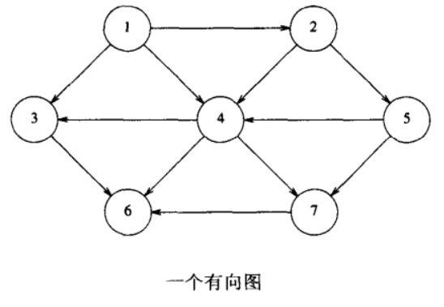
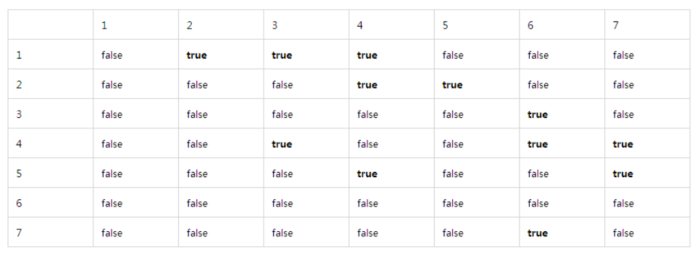
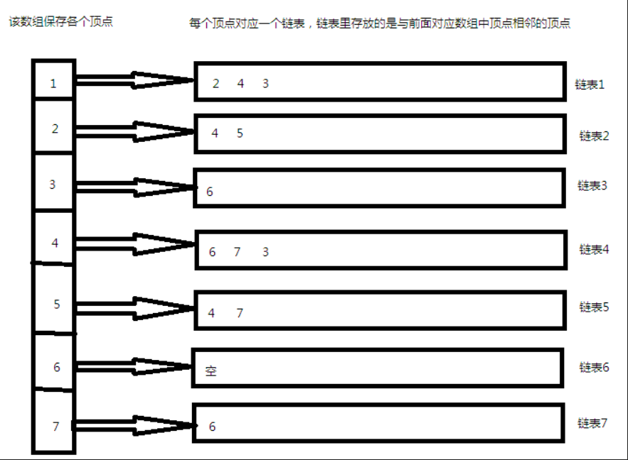
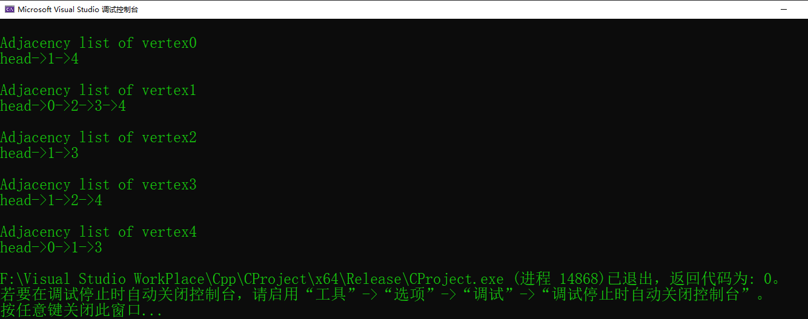

# Introduction_1


## Abstract 
>一个图是一个非线性的数据结构，包含了节点(nodes)和边(edfes)，这些节点有时称为顶点(vertices)，
>边有时称为线(lines)和弧(ars)，他们都是在图中连接任意两个节点的线。那么这样一来就可以更正式地
>定义出图的概念：
>**图是有限顶点或节点(vertices or nodes)和一组连接一对节点的的边组成**
>


>在上面的这幅图中，顶点的集合V = {0,1,2,3,4}和边的集合E={01,12,23,34,04,14,13}。
>图习惯用于解决很多现实生活的问题，图被用于表示网络，可能包括城市道路或电话网络
>又或者是电路网络。图也常常用于社会网络中，如LinkedIn，facebook。
>例如在Facebook中，一个人表示一个节点，每个节点是一个包含了个人信息如id，姓名，性别。

## 图和它的表示
>图是一种数据结构包括了两种组件。
>1. 一组有限的顶点集合称为节点
>2. 一组有限的有序的连接一对节点形成(u,v)称为边。
>值得注意的是，这一对有序的节点(u,v)和(v,u)在有向图的情况下不是一样的。
>这一对(u,v)指示了有一条边从顶点u到顶点v。边可能包含了权重(weight)/值/cost。
>下面的示例中就有五个顶点的图
>

>
>图有下面两个最常用的表示
>1. 邻接矩阵
>2. 邻接链表
>还有一些其他的表示，incidence matrix(关联矩阵)和关联列表，图的表示是特定于情况选择的。
>它的选择总的而言是基于不同操作类型的运行情况和使用的难易。


## 邻接矩阵
> 邻接矩阵是一个2维数组，其大小为V * V，其中V是图中顶点的数量。
> 2维数组表示为adj[][]。  
> 例如一个slot(插槽)的adj[i][j] = 1，表示有一条边从顶点i到顶点j。邻接矩阵对于无向图而言一直
> 都是对称的。邻接矩阵习惯用于表示加权图。如果adj[i][j]=2，表示从顶点i到顶点j的权重为w。
> 如下图一个邻接矩阵的的示例：
> 

>
> 邻接矩阵的Prons(优点):更容易的实现，移去一条边花费O(1)，查询是否存在从顶点'u'到顶点'v'的边
> 是有效的时间复杂度为O(1)。  
> 邻接矩阵的Cons(劣势)：空间复杂度为O(V^2), 即使图形是稀疏的（包含较少数量的边）
> 它也会消耗相同的空间。添加顶点是O（V ^ 2）时间。

## 邻接列表
> 一个列表的数组，数组的大小等于顶点的数量，假如数组为array[]，一个输入
> 条目array[i]表示一个顶点最邻接到顶点i的列表。这样的表示方法同样能够
> 用于表示有权重的图。边的权重也可以存储在节点中。
>


## 示例


> 邻接矩阵表示上面的图，适合于稠密类型的图。
> 
> 
> 
> 邻接列表表示图，该方法适合于稀疏类型的图。
> 
> 

## C++代码
```c++
    #include<vector>
#include<cstdio>
#include<iostream>

using namespace std;

//a utility function to add an edge in an undirect graph
void addEdge(vector<int> adj[], int u, int v) {
	adj[u].push_back(v);
	adj[v].push_back(u);
}

void printGraph(vector<int> adj[], int V) {
	for (int i = 0; i < V; i++)
	{
		cout << "\nAdjacency list of vertex" << i << "\nhead";
		for (auto x : adj[i]) {
			cout << "->" << x;
		}
		printf("\n");
	}
	
}

int main() {	
	const int V = 5;
	vector<int> adj[V];
	addEdge(adj, 0, 1);
	addEdge(adj, 0, 4);
	addEdge(adj, 1, 2);
	addEdge(adj, 1, 3);
	addEdge(adj, 1, 4);
	addEdge(adj, 2, 3);
	addEdge(adj, 3, 4);
	printGraph(adj, V);
	return 0;
}

```

## 代码运行结果


## 参考
[https://blog.csdn.net/coutamg/article/details/65935374](https://blog.csdn.net/coutamg/article/details/65935374)

