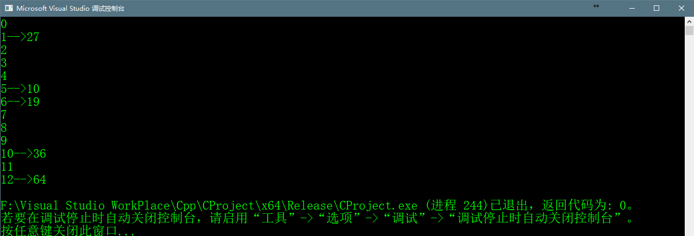

# Double Hashing

>Double Hashing是解决碰撞的一种技巧，双重hash如下使用：  
>(hash1(key) + i * hash2(key) % TABLE_SIZE)  
>这里的hash1()和hash2()都是hash function，TABLE_SIZE是哈希表的大小
  
  >通常hash function是典型的hash1(key) = key % TABLE_SIZE,
  >而第二个hash function一般为hash2(key) = PRIME - (key % PRIME)，其中PRIME是一个比TABLE_SIZE小的数。  
  >第二个hash function比较好的方式有如下原则：  
  >1. 不会为0
  >2. 确保可以检测到所有的桶


## c++完整代码
```c++
    #include <cstdlib>
    #include <iostream>


    using namespace std;

    //hash table size
    #define TABLE_SIZE  13

    //used in second hash function
    #define PRIME 7

    class DoubleHash
    {
    	//pointer to an array containing buckets
    	int *hashTable;
    	int curr_size;
    public:
    	//function to check if hash table is full
    	bool isFull();
    	//hash function one
    	int hash1(int key);
    	//hash function two
    	int hash2(int key);
    	//function to insert key into hash table
    	void insertHash(int key);
    	void displayHash();
    	DoubleHash();
    	~DoubleHash();

    private:

    };

    bool DoubleHash::isFull()
    {
    	//if hash size reaches maximum size
    	return (curr_size == TABLE_SIZE);
    }

    int DoubleHash::hash1(int key)
    {
    	return key % TABLE_SIZE;
    }

    int DoubleHash::hash2(int key)
    {
    	return PRIME - (key %  PRIME);
    }

    void DoubleHash::insertHash(int key)
    {
    	//if hash table is full
    	if (isFull())
    	{
    		return;
    	}
    	//get index from first hash
    	int index = hash1(key);
    	//if collison occurs
    	if (hashTable[index] != -1)
    	{
    		//get index2 from second hash
    		int index2 = hash2(key);
    		int i = 1;
    		while (1)
    		{
    			//get newIndex 
    			int newIndex = (index + i * index2) % TABLE_SIZE;
    			//if no collison occurs,store the key
    			if (hashTable[newIndex] == -1) {
    				hashTable[newIndex] = key;
    				break;
    			}
    			i++;
    		}
    	}
    	//no collision occurs
    	else
    	{
    		hashTable[index] = key;
    	}
    	curr_size++;
    }

    void DoubleHash::displayHash()
    {
    	for (int i = 0; i < TABLE_SIZE; i++) {
    		if (hashTable[i] != -1)
    		{
    			cout << i << "-->" << hashTable[i] << endl;
    		}
    		else
    		{
    			cout << i << endl;
    		}
    	}
    }

    DoubleHash::DoubleHash()
    {
    	hashTable = new int[TABLE_SIZE];
    	curr_size = 0;
    	for (int i = 0; i < TABLE_SIZE; i++)
    	{
    		hashTable[i] = -1;
    	}
    }

    DoubleHash::~DoubleHash()
    {
    	
    }

    int main() {
    	int a[] = { 19,27,36,10,64 };
    	int length = sizeof(a) / sizeof(a[0]);
    	//inserting key into hash table
    	DoubleHash doubleHash;
    	for (int i = 0; i < length; i++)
    	{
    		doubleHash.insertHash(a[i]);
    	}
    	//display the hash table
    	doubleHash.displayHash();
    	return 0;
    }

```

## 代码运行结果
