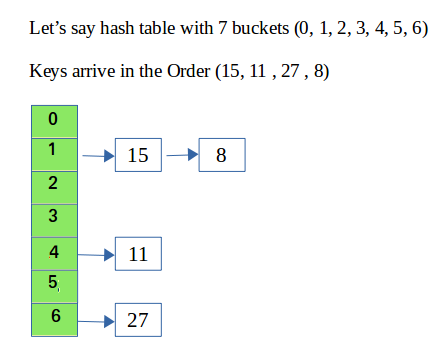
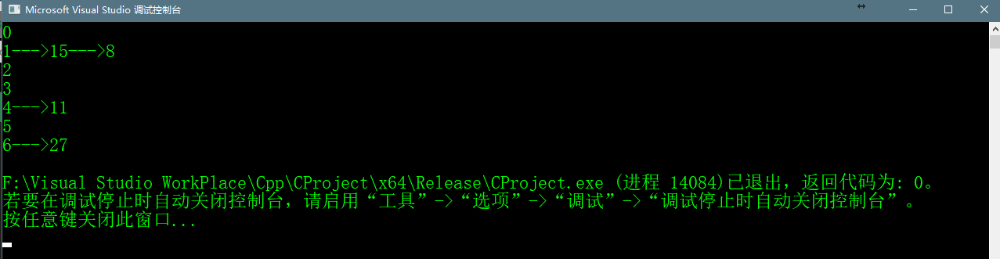

# Program for Hashing with  Chaining

>Chaining方法的主要思想是使得hash table中的每个存储单元都指向链表，
>这些链表都存储着那些具有相同hash function值的记录。  
>我们接下来要创建一个hash table。向hash table中插入一个节点，我们要
>从给定的节点找到hash索引，索引可以使用hash function计算出。  
>例如，hashindex = key % number of the buckets


>insert:通过计算出hash索引移动到相对应的桶中并插入新节点到链表的最后  
>delete:从hash table中删除节点，通过键计算出hash索引，移动到hash table中
>对应的桶中，在对应桶中链表里，通过给定的键查找节点。如果找到就删除。




## c++代码实现

```c++
    //Cpp program to implement hashing with Chaining

    #include<iostream>
    #include<list>

    using namespace std;

    class  Hash
    {
    	//No. of buckets
    	int BUCKET;
    	//pointer to an array containing buckets
    	list<int> *table;
    public:
    	//Constructor 构造函数
    	 Hash(int V);
    	//析构
    	~ Hash();
    	//inserts a key into hash table
    	void insertItem(int key);
    	//delete a key from hash table
    	void deletItem(int key);
    	//hash function to map values to key
    	int hashFunction(int x);
    	void displayHash();

    private:

    };

     Hash:: Hash(int b)
    {
    	 this->BUCKET = b;
    	 table = new list<int>[BUCKET];
    }

     Hash::~ Hash()
    {

    }

     void Hash::insertItem(int key)
     {
    	 int index = this->hashFunction(key);
    	 table[index].push_back(key);
     }

     void Hash::deletItem(int key)
     {
    	 //get the hash index of key
    	 int index = this->hashFunction(key);
    	 //查找该键是list中的第几个索引
    	 list<int>::iterator it;
    	 for ( it = table[index].begin(); it != table[index].end(); it++)
    	 {
    		 if (*it == key) {
    			 break;
    		 }
    	 }
    	 // if key is found int hash table,remove it
    	 if (it != table[index].end()) {
    		 table[index].erase(it);
    	 }
     }

     int Hash::hashFunction(int x)
     {
    	 return (x % this->BUCKET);
     }

     void Hash::displayHash()
     {
    	 for (int i = 0; i < BUCKET; i++) {
    		 cout << i;
    		 for (auto x : table[i]) {
    			 cout << "--->" << x;
    		 }
    		 cout << endl;
    	 }
     }


     int main() {
    	 int a[] = { 15,11,27,8,12 };
    	 int n = sizeof(a) / sizeof(a[0]);
    	 Hash hash(7);
    	 for (int i = 0; i < n; i++) {
    		 hash.insertItem(a[i]);
    	 }
    	// hash.displayHash();
    	 //delte 12 from hash table
    	 hash.deletItem(12);
    	 //display
    	 hash.displayHash();
    	 return 0;
     }
     

```

## 链表解决哈希冲突的运行结果



