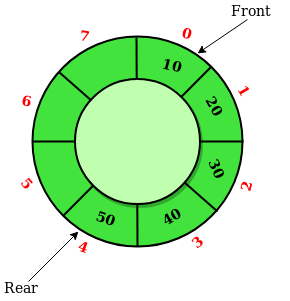

# Circular Queue

## Abstract
>循环队列是一个遵循着基本的FIFO原则的线性数据结构，并且最后一个位置连接着第一个位置，
>这也称作“环形缓冲区”。

>
>
>在常规的队列中，我们能够插入元素直到队列满，但是一旦队列满了，由于队列的性质，只能在一端插入，即使front之前有空的位置也不能插入
>新的元素。如下示意图
>
>


## 循环队列的操作
>Front：取得队列中最前的元素
>Rear：取得队列中最后的元素
>enQueue(value)：此方法用于在循环队列中插入一个元素，在循环队列中，插入一个元素总是在Rear的位置
>#### Steps：
>1.检查队列是否已满,即（rear == size - 1 && front == 0）|| (rear == front - 1)（这段话可以看图理解）
>2.队列已满则退出，未满则如果(rear == size - 1 && front != 0)为true，则置rear = 0并且插入元素。
>deQueue()：这个方法用于从循环队列中删除一个元素，在循环队列中，元素总是在front处删除。
>#### Steps：
>1.检查队列是否为空，即front == -1
>2.如果为空则显示队列为空，队列不为空，并且front == rear为true(表示只有一个元素)，则让front = rear = -1，否则如果front == size - 1为true，则
>front=0，并且返回元素值。


## C++代码实现
```c++
    // C or C++ program for insertion and 
    // deletion in Circular Queue 
    #include <cstdlib>
    #include <iostream>

    using namespace std;

    struct CircularQueue
    {
    	//初始化front 和 rear
    	int rear, front;
    	int size;
    	int *arr;
    	CircularQueue(int s) {
    		front = rear = -1;
    		size = s;
    		arr = new int[s];
    	}

    	void enQueue(int value);
    	int deQueue();
    	void displayQueue();
    };

    //用于创建Circular queue的方法
    void CircularQueue::enQueue(int value)
    {
    	//判断满
    	if ((front == 0 && rear == size - 1) || (rear == (front - 1) % (size - 1))) {
    		cout << "Queue is Full" << endl;
    		return;
    	}
    	else if (front == - 1)
    	{
    		front = rear = 0;
    		arr[rear] = value;
    	}
    	//如果front不在首位置，rear不在末位置，则让rear移动到第一位置
    	else if (rear == size - 1 && front != 0) {
    		rear = 0;
    		arr[rear] = value;
    	}
    	else {
    		rear++;
    		arr[rear] = value;
    	}
    }

    //出队
    int CircularQueue::deQueue()
    {
    	//如果为空
    	if (front == -1) {
    		cout  << endl << "Queue is empty";
    		return INT_MIN;
    	}
    	int data = arr[front];
    	//如果队头指针和队尾指针都指向同一个元素，则把队列置空
    	if (front == rear)
    	{
    		front = -1;
    		rear = -1;
    	}
    	else if (front == size - 1) {
    		front = 0;
    	}
    	else {
    		front++;
    	}
    	return data;
    }

    void CircularQueue::displayQueue()
    {
    	if (front == -1)
    	{
    		printf("\nQueue is Empty");
    		return;
    	}
    	printf("\nElements in Circular Queue are: ");
    	if (rear >= front)
    	{
    		for (int i = front; i <= rear; i++)
    			printf("%d ", arr[i]);
    	}
    	else
    	{
    		for (int i = front; i < size; i++)
    			printf("%d ", arr[i]);

    		for (int i = 0; i <= rear; i++)
    			printf("%d ", arr[i]);
    	}
    }

    /* Driver of the program */
    int main()
    {
    	CircularQueue q(5);

    	// Inserting elements in Circular Queue 
    	q.enQueue(14);
    	q.enQueue(22);
    	q.enQueue(13);
    	q.enQueue(-6);

    	// Display elements present in Circular Queue 
    	q.displayQueue();

    	// Deleting elements from Circular Queue 
    	printf("Deleted value = %d\n", q.deQueue());
    	printf("Deleted value = %d\n", q.deQueue());

    	q.displayQueue();

    	q.enQueue(9);
    	q.enQueue(20);
    	q.enQueue(5);

    	q.displayQueue();

    	q.enQueue(20);
    	return 0;
    }
```

## 代码运行结果


