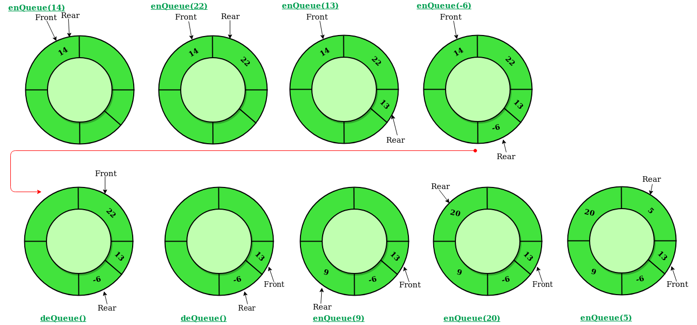

# Circular Queue

## Abstract
>循环队列是一个遵循着基本的FIFO原则的线性数据结构，并且最后一个位置连接着第一个位置，
>这也称作“环形缓冲区”。

>
>
>在常规的队列中，我们能够插入元素直到队列满，但是一旦队列满了，即使front之前有空的位置也不能插入
>新的元素。如下示意图
>
>

## 循环队列的操作
>Front：取得队列中最前的元素
>Rear：取得队列中最后的元素
>enQueue(value)：此方法用于在循环队列中插入一个元素，在循环队列中，插入一个元素总是在Rear的位置
>#### Steps：
>1.检查队列是否已满,即（rear == size - 1 && front == 0）|| (rear == front - 1)
>2.队列已满则退出，未满则如果(rear == size - 1 && front != 0)为true，则置rear = 0并且插入元素。
>deQueue()：这个方法用于从循环队列中删除一个元素，在循环队列中，元素总是在front处删除。
>#### Steps：
>1.检查队列是否为空，即front == -1
>2.如果为空则显示队列为空
>3.队列不为空，如果front == rear为true，则让front = rear = -1，否则如果fonrt == size - 1为true，则
>front=0，并且返回元素值。

