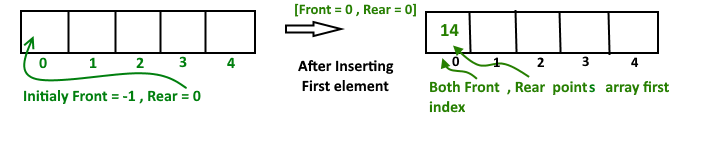

# Deque（双端队列）

## Abstract
>Deque或者Double Ended Queue是一种常见的可以在两端都插入元素的队列。如下图
>
>

## 双端队列的操作
>在双端队列中主要有以下四个基本操作
>1. insertFront()：在双端队列的前端插入元素
>2. insertLast()：在双端队列的尾部插入元素
>3. deleteFront()：从双端队列的头部删除元素
>4. deleteLast()：中双端队列的尾部删除元素
>除了上述的操作，以下的操作双端队列也支持  
>1. getFront()：从队列头获得一个元素
>2. getRear()：从队列尾获得一个元素
>3. isEmpty()：检查是否为空
>4. isFull()：检查是否已满

## Application of Deque
>因为双端队列有着栈和队列类似的操作，并且它可以顺时针或逆时针的插入元素和获取元素，时间复杂度为O(1)。
>这样的特性会有很多的用途。  
>C++ STL提供双端队列的实现，std::deque

## Implement
>一个双端队列可以使用Doubly Linked List或者一个循环数组实现。在所有的这些实现中，我们都能做的操作的时间复杂度为
>O(1)。

## Circular array implemention deque
>对于实现双端队列，我们需要有两个指针，front和rear，我们插入(enQueue)一个元素在Deque的头端或尾端，或者在两端
>出队(deQueue)。
>使用数组创建一个双端队列
>1.创建一个空的数组设置其大小为n，初始化front = -1,rear = 0;插入第一个元素在双端队列，在front或rear插入都会有一样的结果
>
> 
>a).刚开始我们检查双端列表isFull()
>b).如果 Rear == Size - 1
>2.
>

