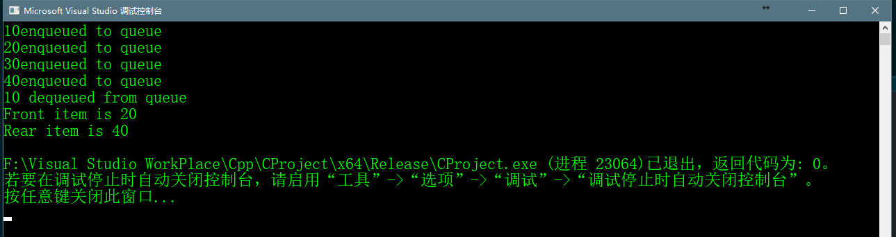

# Introduction Queue


## Abstract
>队列是一种遵循特殊操作的线性数据结构，其顺序是Frist In First out(FIFO)，生活中最好的关于队列的例子就是
>排队，排在最前面的人能最快的得到服务。队列与栈的不同之处在于它们移出元素。在栈中移除一个元素是最近一次
>添加的元素，但在队列中，移除的是最后添加的元素。


## 队列的操作
>队列有以下四个基本的特殊的操作  
>Enqueue：添加一个元素到队列中，如果队列已满，则说明其达到上溢条件。  
>Dequeue：从队列中移除一个元素，和它们入队的顺序一样，先进来的元素要先出去。如果队列是空的，则说明
>达到了下溢条件。  
>Front：获得队列中最前一个元素
>Rear：获得队列中最后一个元素

## 队列的应用
>队列常常用在那些不用被立即处理但又必须被处理的事项中，队列这样的性质用与许多场景。
>1. 当一个资源被多个消费者共享的时候，例如CPU调度，桌面调度
>2. 当数据异步(数据的接和收不在同一个速率)转移在不同处理器的时候，例如IO缓冲，文件IO等

## 使用数组实现队列
>对于实现队列，我们需要有两个指针，front和rear，一个元素从rear入队，一个元素中front出队，
>如果我们只是单纯的增加front和rear指针，可能会出现一些问题，front指针可能会越过数组下标，
>解决这个问题的办法是循环增加front和rear。


## c++完整代码实现
```c++
    //CPP program for array implementation of queue
    #include <iostream>
    #include <cstdlib>
    #include <limits>

    using namespace std;

    class Queue {
    public:
    	int front, rear, size;
    	unsigned capacity;
    	int* array;
    };

    Queue *createQueue(unsigned capacity)
    {
    	Queue* queue = new Queue();
    	queue->capacity = capacity;
    	queue->front = queue->size = 0;
    	queue->rear = capacity - 1;//this is important, see the enqueue
    	queue->array = new int[(queue->capacity * sizeof(int))];
    	return queue;
    }

    //Queue is full when size becomes equal to the capacity
    int isFull(Queue * queue)
    {
    	return (queue->size == queue->capacity);
    }

    //queue is empty when size is 0
    int isEmpty(Queue * queue)
    {
    	return (queue->size == 0);
    }

    //function to add an item to the queue,it chages rear and front
    void enqueue(Queue * queue,int item)
    {
    	if (isFull(queue))
    	{
    		return;
    	}
    	// "%" priority higher than "+"
    	queue->rear = (queue->rear + 1) % queue->capacity;
    	queue->array[queue->rear] = item;
    	queue->size = queue->size + 1;
    	cout << item << "enqueued to queue\n";
    }

    //function to remove an item from queue
    int dequeue(Queue* queue) {
    	if (isEmpty(queue))
    	{
    		return INT_MIN;
    	}
    	int item = queue->array[queue->front];
    	queue->front = (queue->front + 1) % queue->capacity;
    	queue->size = queue->size - 1;
    	return item; 
    }

    //function to get rear of queue
    int front(Queue* queue) {
    	if (isEmpty(queue)) {
    		return INT_MIN;
    	}
    	return queue->array[queue->front];
    }

    //function to get rear of queue
    int rear(Queue* queue) {
    	if (isEmpty(queue))
    	{
    		return INT_MIN;
    	}
    	return queue->array[queue->rear];
    }

    int main()
    {
    	Queue* queue = createQueue(1000);

    	enqueue(queue, 10);
    	enqueue(queue, 20);
    	enqueue(queue, 30);
    	enqueue(queue, 40);

    	cout << dequeue(queue) << " dequeued from queue\n";

    	cout << "Front item is " << front(queue) << endl;
    	cout << "Rear item is " << rear(queue) << endl;

    	return 0;
    }
```

## 代码运行结果
