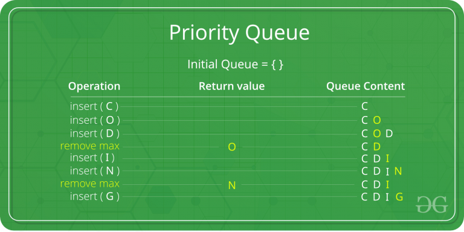
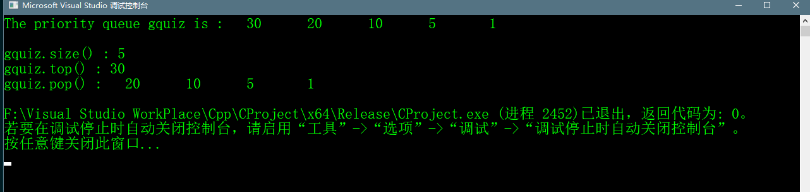

# Priority Queue

## Abstract
>优先队列是队列的一种扩展，它具有如下性质：
>1. 每个item都有一个相关的优先等级
>2. 一个具有高优先级的元素会比优先级更低的元素更快出队
>3. 如果有个元素具有相同的优先级，那么他们以在队列中的顺序为标准出队。  
>例如下图，元素的ASCII码值最大在优先队列中具有最高的优先级




>一个经典的优先队列支持以下操作：  
>1. **insert(item,priority)**：插入一个元素并给定优先级
>2. **getHighestPriority()**：返回优先级最大的元素
>3. **deleteHighestPriority()**：删除优先级最大的元素  
>如何实现一个优先队列
>### 1. 使用数组
>一个简单的实现就是使用下面这种结构的数组  

```c++
    struct item{
        int item;
        int priority;
    
```
>insert()操作是将元素添加到数组最后，这样insert()操作的时间复杂度为O(1)  
>getHighestPriority()操作将在数组中线性的搜索元素，这样操作的时间复杂度为O(n)  
>deleteHighestPriority()操作同样可以线性的搜索然后删除元素，最后再将被删除的元素的向后移动  
>同样的我们可以使用链表实现以上的操作，但是以上的操作在链表中的时间复杂度和使用数组实现的时间复杂度是类似的。
>不过在deleteHighestPriority()操作的时候更有效率些，因为我们不用移动元素。

>### 2. 使用堆
>堆通常用来实现优先队列，因为相比于数组和链表堆能提供更好的运行效果。在二叉堆中getHighestPriority()
>可以实现时间复杂度为O(1)，insert()和deleteHighestPriority()能够实现的时间复杂度为O(logn)。在费波纳茨堆
>中可以实现inert()和getHighestPriority()方法时间复杂度为O(1)，deleteHighest()可以实现时间复杂度为O(logn)。

## Priority Queue的应用
>1. CPU调度
>2. 图中算法，比如迪杰克斯拉的最短路径算法，普利姆的最小生成树
>3. 之前介绍的几乎也都有用到优先队列


## c++ STL priority_queue的使用

```c++
    #include <iostream> 
    #include <queue> 

    using namespace std;

    void showpq(priority_queue <int> gq)
    {
    	priority_queue <int> g = gq;
    	while (!g.empty())
    	{
    		cout << '\t' << g.top();
    		g.pop();
    	}
    	cout << '\n';
    }

    int main()
    {
    	priority_queue <int> gquiz;
    	gquiz.push(10);
    	gquiz.push(30);
    	gquiz.push(20);
    	gquiz.push(5);
    	gquiz.push(1);

    	cout << "The priority queue gquiz is : ";
    	showpq(gquiz);

    	cout << "\ngquiz.size() : " << gquiz.size();
    	cout << "\ngquiz.top() : " << gquiz.top();


    	cout << "\ngquiz.pop() : ";
    	gquiz.pop();
    	showpq(gquiz);

    	return 0;
    }
```

## 运行效果



