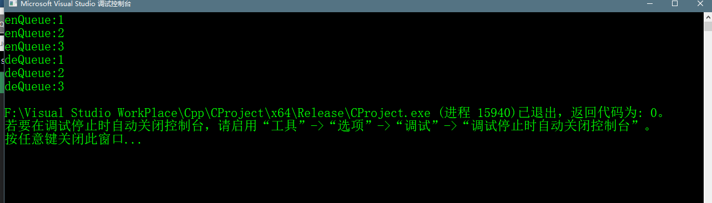

# Queue using Stacks

## Abstract 
>给定一个栈结构，有着push和pop操作，现在的任务是使用栈结构实现队列结构的操作。


>一个队列可以用两个栈实现，假设实现的队列为q，实现它的两个栈为stack1，stack2。有以下两种方法实现

## 方法一 (使得enQueue操作花费昂贵)
>这个方法确定进入的最后一个元素一直都在stack1的top上，以至于deQueue操作仅仅只是从stack1中pops，将元素放入
>stack1中，stack2用于以下操作：  
>**enQueue(q,x)**  
>1. 当stack1不为空时，将stack1中元素都push到stack2中
>2. push x 到stack1(假设stack的大小是无限的)
>3. 将stack2中的所有元素都push回stack1  
>这里的时间复杂度为O(n)
>
>**deQueue**：  
>1.如果stack1为空，则提示错误
>2.中stack1中pop一个元素并且返回这个值  
>这里的时间复杂度为O(1)


## c++代码实现
```c++
    // CPP program to implement Queue using 
    // two stacks with costly enQueue() 
    #include <stack> 
    #include <iostream>

    using namespace std;

    struct Queue {
    	stack<int> s1, s2;

    	void enQueue(int x)
    	{
    		// Move all elements from s1 to s2 
    		while (!s1.empty()) {
    			s2.push(s1.top());
    			s1.pop();
    		}

    		// Push item into s1 
    		s1.push(x);
    		cout << "enQueue:" << x << endl;

    		// Push everything back to s1 
    		while (!s2.empty()) {
    			s1.push(s2.top());
    			s2.pop();
    		}
    	}

    	// Dequeue an item from the queue 
    	int deQueue()
    	{
    		// if first stack is empty 
    		if (s1.empty()) {
    			cout << "Q is Empty";
    			exit(0);
    		}

    		int x = s1.top();
    		// Return top of s1 
    		cout << "deQueue:" ;
    		s1.pop();
    		return x;
    	}
    };

    // Driver code 
    int main()
    {
    	Queue q;
    	q.enQueue(1);
    	q.enQueue(2);
    	q.enQueue(3);

    	cout << q.deQueue() << '\n';
    	cout << q.deQueue() << '\n';
    	cout << q.deQueue() << '\n';

    	return 0;
    }
```

## 代码运行效果


