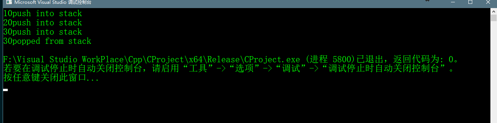
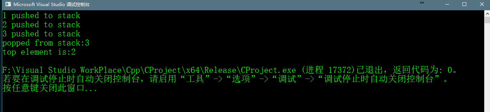

# Stack Data Structure

## Abstract

> 栈是一种线性的数据结构，它有着特殊的操作和运行方式。其顺序是LIFO(Last In First Out)。现实生活中有许多事物就像栈一样，
> 比如食堂中堆叠的盘子，放在最顶层的盘子是最先被拿走，而在最底层的一个盘子将会保留最长时间最后被拿走。或者可以把栈
> 看作一个羽毛球筒，打开盖子后最底下的一个羽毛球是第一个放入，但是如果要拿出的话则是最后一个拿出。
> 
>栈中主要有执行以下几种基本操作。

#### ① Push：添加一个项目在栈中。如果栈已满，则称之为溢出条件。
#### ② Pop：移除栈顶的项目。如果栈是空的，则称之为下溢条件。
#### ③ Peek or Top：返回栈中最顶层的元素。
#### ④ isEmpty：如果栈为空则返回真，否则返回假。

>push，pop，isEmpty，peek这些操作的时间复杂度都为O(1)，这些操作我们不需要做任何的循环。
>栈的实现有两种方式，第一种为使用数组，第二种为使用Linked List。下面代码使用的是Array。


```c++
    #include <iostream>

    using namespace std;

    #define MAX 10000

    class Stack
    {
    public:
    	int a[MAX];
    	Stack();
    	~Stack();
    	int pop();
    	bool push(int x);
    	bool isEmpty();

    private:
    	int top;
    };
    
    //initialize stack
    Stack::Stack()
    {
    	top = -1;
    }

    Stack::~Stack()
    {
    }

    int Stack::pop()
    {
    	if (top < 0)
    	{
    		cout << "Stack Underflow" ;
    		return false;
    	}
    	else
    	{
    		int x = a[top--];
    		return x;
    	}
    }

    bool Stack::push(int x)
    {
    	if (top >= (MAX - 1))
    	{
    		cout << "Stack Overflow";
    		return false;
    	}
    	else
    	{
    		a[++top] = x;
    		cout << x << "push into stack\n";
    		return true;
    	}
    }

    bool Stack::isEmpty()
    {
    	return top < 0;
    }


    int main() {
    	class Stack stack;
    	stack.push(10);
    	stack.push(20);
    	stack.push(30);
    	cout << stack.pop() << "popped from stack\n";
    	return 0;
    }
```

## 使用Array实现Stack的代码运行效果




## 使用Linked List实现Stack

```c++
    #include<cstdio>
    #include<cstdlib>
    #include<climits>

    /**
    	c program for linked list implementation of stack
    */

    //create a new node
    struct StackNode* newNode(int data);
    //判断栈是否为空
    int isEmpty(struct StackNode* head);
    //将节点push入栈
    void push(struct StackNode** head_ref,int data);
    //弹出栈顶的元素
    int pop(struct StackNode** head_ref);
    //获得栈顶元素的值
    int peek(struct StackNode* head);

    struct StackNode {
    	int data;
    	struct StackNode* next;
    };

    //创建一个新节点，并返回一个指向该新节点的指针
    struct StackNode* newNode(int data) {
    	struct StackNode* stackNode = (struct StackNode*)malloc(sizeof(struct StackNode));
    	stackNode->data = data;
    	stackNode->next = NULL;
    	return stackNode;
    }

    int isEmpty(struct StackNode* head) {
    	return !head;
    }

    void push(struct StackNode** head_ref, int data) {
    	struct StackNode* stackNode = newNode(data);
    	stackNode->next = *head_ref;
    	*head_ref = stackNode;
    	printf("%d pushed to stack\n", data);
    }

    int pop(struct StackNode** head_ref) {
    	if (isEmpty(*head_ref))
    	{
    		//在climits文件中定义的
    		return INT_MIN;
    	}
    	//取得现在的头结点
    	struct StackNode* temp = *head_ref;
    	//头指针指向下一个节点
    	*head_ref = (*head_ref)->next;
    	int popped = temp->data;
    	//释放弹出节点的内存
    	free(temp);
    	//返回节点值
    	return popped;
    }

    int peek(struct StackNode* head){
    	if (isEmpty(head))
    	{
    		printf("the stack is empty!\n");
    		return INT_MIN;
    	}
    	return head->data;
    }

    int main() {
    	struct StackNode* head;
    	push(&head, 1);
    	push(&head, 2);
    	push(&head, 3);
    	
    	printf("popped from stack:%d\n", pop(&head));
    	printf("top element is:%d\n", peek(head));
    	return 0;
    }

```
>相比与使用Linked List实现栈，能够自行根据使用的内存的多少分配空间，而不像数组一样一次性分配一大块内存空间
>但同时也需要额外存放多余的指针。


## 使用Linked List实现Stack的代码运行效果




## Stack in c++ STL
> Stacks are a type of container adaptors with LIFO(Last In First Out) type of working, where a new element is added at one end and (top) an element is removed from that end only.

> The functions associated with stack are:
> 1. empty() – Returns whether the stack is empty – Time Complexity : O(1)
> 2. size() – Returns the size of the stack – Time Complexity : O(1)
> 3. top() – Returns a reference to the top most element of the stack – Time Complexity : O(1)
> 4. push(g) – Adds the element ‘g’ at the top of the stack – Time Complexity : O(1)
> 5. pop() – Deletes the top most element of the stack – Time Complexity : O(1)

## CPP program to demonstrate working of STL stack

```c++
    #include<iostream>
    #include<stack>

    using namespace std;

    void showStack(stack <int> s) {
    	while (!s.empty()) {
    		cout << "\t" << s.top();
    		s.pop();
    	}
    	cout << "\n";
    }

    int main() {
    	stack<int> s;
    	s.push(10);
    	s.push(30);
    	s.push(20);
    	s.push(5);
    	s.push(1);
    	cout << "the stack is:";
    	showStack(s);
    	
    	cout << "s.size():" << s.size();
    	cout << "\n";
    	cout << "s.top():" << s.top();
    	cout << "\n";
    	cout << "s.pop():" << s.top();
    	cout << "\n";
    	showStack(s);
    	return 0;
    }
```