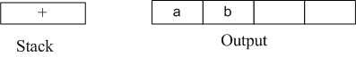
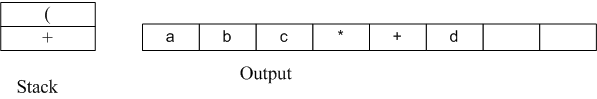
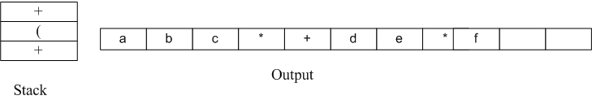

# Infix to Postfix

Infix expression(中缀表达式)： 操作符是以中缀形式处于操作数的中间（例：形如3 + 4），中缀表达式是人们常用的算术表示方法。
Postfix expre(后缀表达式)：也称为逆波兰表达式，操作符是以后缀形式位于操作数之后（例：形如3 4 +）

# 为什么要用后缀表达式
> 在编译器中扫描表达式，可以从左至右扫描，或者从右至左扫描。考虑以下的表达式：a op1 b op2 c op3 d，如果
> op1为+，op2为*，op3为+。则编译器第一次扫描表达式的时候应该计算b * c，然后再次扫描表达式后再+一个a，最后
> 表达式的值应为最后加上d值后的总和。像上面这样多次重复的扫描计算是十分低效的，更好的方法是在的计算前将表达式
> 转换成后缀表达式。上面这个a + b * c + d正确的后缀表达式为a b c * + d +。后缀表达式能够使用栈轻松的转换出来，

# 转换后缀表达式的算法
>### ① 从左到右扫描中缀表达式
>### ② 如果扫描到一个操作数，则添加到输出字符串中
>### ③ 否则
>##### i.如果再扫描到的运算符的优先级*大于*栈顶运算符的优先级(或者栈为空或栈顶为”(“，即小括号的左边)，则
>##### 将扫描到的操作符推入栈中。
>##### ii.如果再扫描到的运算符的优先级*小于或等于*栈顶运算符的优先级，从栈中依次弹出优先级大于或等于
>##### *被扫描到的操作符* 的那些操作符直到遇到优先级更高小的操作符或左括号或者空栈，pop完成后再将扫描到的操作符入栈。
>##### 因为优先级一样运算顺序是从左往右
>### ④ 如果扫描到的字符是一个"("，直接推入栈中，即使栈顶"("也推入。
>### ⑤ 如果扫描到的字符一个")"，弹出栈中所有的元素直到遇到一个"("。
>### ⑥ 重复②-⑥步骤直到整个中缀表达式扫描结束，并弹出栈中所有元素。
>### ⑦ 输出 字符串

## 示例
>输入为a + b * c + (d * e + f)*g，处理过程如下：
>1. 首先读到a，直接输出。
>2. 读到“+”，将其放入到栈中。
>3. 读到b，直接输出。
>此时栈和输出的情况如下：
>
>
>
>4. 读到“*”，因为栈顶元素"+"优先级比" * " 低，所以将" * "直接压入栈中。
>5. 读到c，直接输出。
>此时栈和输出情况如下：
>
>
>
> 6. 读到" + "，因为栈顶元素" * "的优先级比它高，所以弹出" * "并输出， 同理，栈中下一个元素" + "优先级与读到的操作符" + "一样，所以也要弹出并输出。然后再将读到的" + "压入栈中。
> 此时栈和输出情况如下：
> 
> 
> 
>7. 下一个读到的为"("，它优先级最高，所以直接放入到栈中。
>8. 读到d，将其直接输出。
> 此时栈和输出情况如下：
> 
> 
> 
>9. 读到" * "，由于只有遇到" ) "的时候左括号"("才会弹出，所以" * "直接压入栈中。
>10. 读到e，直接输出。
> 此时栈和输出情况如下：
> 
> 
> 
> 11.读到" + "，弹出" * "并输出，然后将"+"压入栈中。
> 12. 读到f，直接输出。
> 此时栈和输出情况：
> 
> 
> 
> 13. 接下来读到“）”，则直接将栈中元素弹出并输出直到遇到"("为止。这里右括号前只有一个操作符"+"被弹出并输出。
> 
> 
> 
> 14. 读到" * "，压入栈中。读到g，直接输出。
> 
> 
> 
> 15. 此时输入数据已经读到末尾，栈中还有两个操作符“*”和" + "，直接弹出并输出。
> 
> 


## C语言完整代码
```c
    //c program to convert infix experession to postfix

    #include <stdio.h>
    #include <stdlib.h>
    #include <string.h>

    //Stack type
    struct Stack {
    	int top;
    	unsigned int capacity;
    	int *array;
    };个


    //Stack Operations
    struct Stack* createStack(unsigned int capacity)
    {
    	struct Stack* stack = (struct Stack*)malloc(sizeof(struct Stack));
    	if (!stack)
    	{
    		return NULL;
    	}

    	stack->top = -1;
    	stack->capacity = capacity;
    	stack->array = (int*)malloc(sizeof(capacity * sizeof(int)));
    	if (!stack->array)
    	{
    		return NULL;
    	}
    	return stack;
    };

    int isEmpty(struct Stack* stack) {
    	return stack->top == -1;
    }
    char peek(struct Stack* stack) {
    	return stack->array[stack->top];
    }

    char pop(struct Stack* stack) {
    	if (!isEmpty(stack))
    	{
    		return stack->array[stack->top--];	
    	}
    	return '$';
    }

    void push(struct Stack* stack, char op) {
    	stack->array[++stack->top] = op;
    }

    //check if the given character is operand
    int isOperand(char ch) {
    	return (ch >= 'a' && ch <= 'z') || (ch >= 'A' && ch <= 'Z');
    }

    //A utility function to return precedence of a given operator
    //Higher returned value means higher
    int prec(char ch) {
    	switch (ch)
    	{
    	case '+':
    	case '-':
    		return 1;
    	case '*':
    	case '/':
    		return 2;
    	case '^':
    		return 3;
    	}
    	return -1;
    }


    //the main funtion than convert given character infix expression
    //to postfix expression
    int infixToPostfix(char* exp) {
    	//Create a stack of capacity equal to expression size
    	struct Stack* stack = createStack(strlen(exp));
    	//see if stack was created successfully
    	if (!stack)
    	{
    		return -1;
    	}
    	int i = 0, k = -1;
    	for (i = 0, k = -1; exp[i] != '\0'; ++i) {
    		//如果扫描到的字符是一个操作数，则添加到输出字符串
    		if (isOperand(exp[i])) 
    		{
    			exp[++k] = exp[i];
    		}
    		//如果扫描到的字符是左括号"(",入栈
    		else if (exp[i] == '(') 
    		{
    			push(stack,exp[i]);
    		}
    		//如果扫描到了右括号")",从栈中弹出操作符直到"("
    		else if (exp[i] == ')')
    		{
    			while (!isEmpty(stack) && peek(stack) != '(')
    			{
    				exp[++k] = pop(stack);
    			}
    			if (!isEmpty(stack) && peek(stack) != '(')
    			{
    				//无效的表达式
    				return -1;
    			}
    			else
    			{
    				pop(stack);
    			}
    		}
    		else
    		{
    			//遇到一个操作符 如果优先级比栈顶小或相等 则弹出操作符直到遇到优先级更大的或栈空或"("
    			while (!isEmpty(stack) && prec(exp[i]) <= prec(peek(stack)))
    			{
    				exp[++k] = pop(stack);
    			}
    			//弹出栈完成后再把扫描到的推入栈
    			push(stack, exp[i]);
    		}
    	}
    	//扫描完之后弹出栈中剩余的字符
    	while (!isEmpty(stack))
    	{
    		exp[++k] = pop(stack);
    	}
    	//在输出字符串中添加结束符号
    	exp[++k] = '\0';
    	//打印完成后的中缀表达式
    	printf("%s", exp);
    	//变量k的意义就在于存储表达式可以用传入的表达式的存储空间，不需要重新定义额外空间
    }


    int main() {
    	char exp1[] = "a+b*(c^d-e)^(f+g*h)-i";
    	char exp2[] = "a+b*c+(d*e+f)*g";
    	char* expPoint = exp1;
    	printf("before converted:%s",exp1);
    	printf("\n");
    	printf("after converted:%s");
    	infixToPostfix(expPoint);
    	return 0;
    }

```

## 运行结果


## 参考
>本文部分参考了：
>1. [https://blog.csdn.net/sgbfblog/article/details/8001651](https://blog.csdn.net/sgbfblog/article/details/8001651)
>2. [https://blog.csdn.net/qq_29542611/article/details/79134163](https://blog.csdn.net/qq_29542611/article/details/79134163)