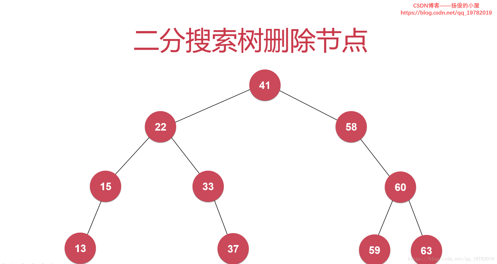
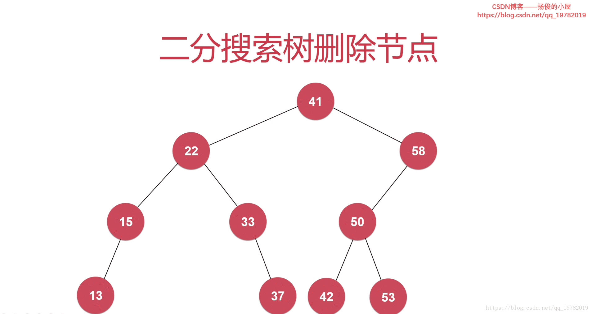
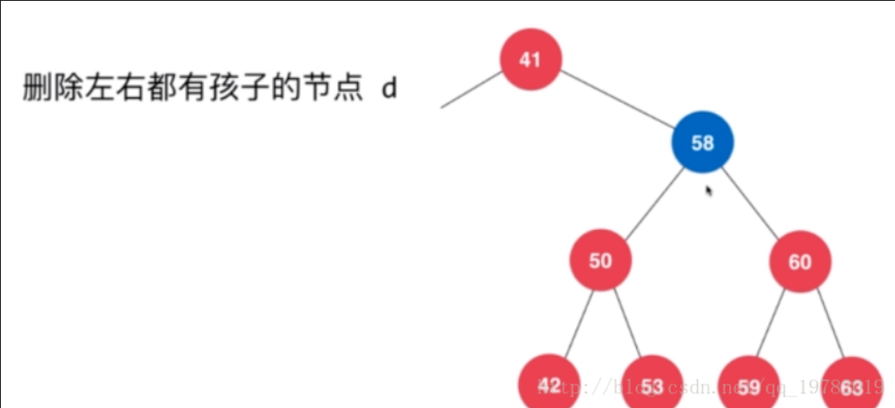
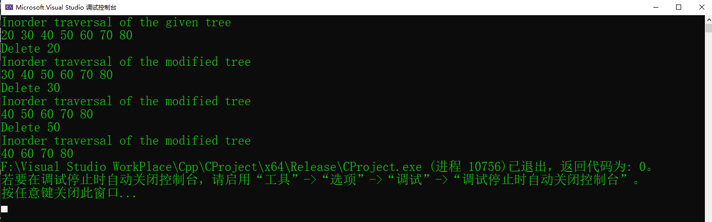

# Binary Search Tree Delete_15

# Abstract 
>这里我们将讨论BST的删除节点，将会出现三种可能性。
>1. 被删除的是叶子节点，只需要简单的将这个节点删除即可
>
             50                            50
           /     \         delete(20)      /   \
          30      70       --------->    30     70 
         /  \    /  \                     \    /  \ 
       20   40  60   80                   40  60   80
>2. 被删除的节点仅有一个子节点，将子节点复制然后删除子节点
>
              50                            50
           /     \         delete(30)      /   \
          30      70       --------->    40     70 
            \    /  \                          /  \ 
            40  60   80                       60   80






>3.被删除的节点有两个子节点，这里就不能像上面那样直接保存子节点，然后返回给上一层节点了。下面详细讨论
>
            50                            60
           /     \         delete(50)      /   \
          40      70       --------->    40    70 
                 /  \                            \ 
                60   80                           80

> 如下图要删除58节点
> 
> 
> 假设我们要删除58这个节点，但是58既有左子树，也有右子树，那么我们删除了58之后应该要怎么样
> 找一个节点连接剩余的两个子树在并到41的右节点呢，如果是像上面一样选择一个左子树的节点或者
> 右子树的节点作为58的“替代物”，那么这是行不通的，因为按照二叉树的定义，**根节点的左子树都要比
> 根节更小，右子树都要比根节点更大**。58确实比它的左子树的更大，比它的右子树都更小。如果换成50或者
> 60呢？显然这是错误的，50比53小，60又大于59，不满足二叉排序树的条件。

>我们需要招待58节点的替代节点，并且满足二叉排序树的定义，如果我们在**58节点的左子树到一个最大的节点**
>或者在**58节点的右子树找到一个最小的节点**，这样就一定能满足二叉排序树的条件。

## 对于查找最大最小节点代码如下
```c++
    // 返回以node为根的二分搜索树的最小键值所在的节点
    node* minmum(node* node){
        if( node->left == NULL )//如果该节点不存在左子树了，那么该节点就是这课树的最小节点
            return node;
        return minmum(node->left);//如果该节点还存在左子树，说明该节点并不是最小节点
                                      //则必须继续往它的左子树搜索下去(运用递归的方法）
    }

    // 返回以node为根的二分搜索树的最大键值所在的节点
    node* maximum(node* node){
        if( node->right == NULL )//如果该节点没有右子树了，说明为最大的节点
            return node;
 
        return maximum(node->right);//该节点还存在右子树的话，说明还有比它更大的节点存在
                                            //因此该节点肯定不是最大节点，我们还要往“右边”搜索
    }
```

## c++完整代码
```c++
    // c/c++ program to demostrate delte operation in BST
    #include <cstdio>
    #include <cstdlib>


    struct node {
    	int key;
    	struct node* left;
    	struct node* right;
    };

    struct node* newNode(int data) {
    	struct node* newNode = (struct node*)malloc(sizeof(struct node*));
    	newNode->key = data;
    	newNode->left = NULL;
    	newNode->right = NULL;
    	return newNode;
    }

    void inorder(struct node* root) {
    	if (root != NULL)
    	{
    		inorder(root->left);
    		printf("%d ", root->key);
    		inorder(root->right);
    	}
    }


    struct node* insert(struct node* node, int data) {
    	if (node == NULL)
    	{
    		return newNode(data);
    	}

    	if (data < node->key) {
    		node->left = insert(node->left, data);
    	}
    	if (data > node->key)
    	{
    		node->right = insert(node->right, data);
    	}
    	//这里在最后一次递归完成后，返回的一直都是根节点
    	return node;
    }

    //找到BST中最小的值的节点
    struct node* minValueNode(struct node* root) {
    	struct node* current = root;
    	/*我们已经了解到了一棵二叉树的最
    	小值节点位于这颗树的“最左边”，
    	最大节点位于这棵树的“最右边”，
    	因此我们可以很容易的写出一个查找二叉树中最小节点的方法*/
    	while (current && current->left != NULL)
    	{
    		current = current->left;
    	}
    	return current;
    }

    //given BST and key,this function deletes the key and returns the
    //new root
    struct node* deleteNode(struct node* root, int key) {
    	//special case
    	if (root == NULL) {
    		return root;
    	}

    	//if the key to be delete is smaller 
    	//than the root's key,then it lies in 
    	// left subree
    	if (key < root->key)
    	{
    		root->left = deleteNode(root->left, key);
    	}
    	//if the key to be deleted is greater than the root's
    	//key,then it lies in right subtree
    	else if(key > root->key)
    	{
    		root->right = deleteNode(root->right, key);
    	}
    	//if key is same as root's key,then this is the node 
    	//to be deleted
    	else {
    		//1. 只有一个子节点或没有子节点的情况
    		//将他们的对应下一层节点保存下来
    		//一定要先保存，再释放内存！！！
    		if (root->left == NULL)
    		{
    			struct node* temp = root->right;
    			free(root);
    			return temp;
    		}
    		else if (root->right == NULL)
    		{
    			struct node* temp = root->left;
    			free(root);
    			return temp;
    		}

    		//2. 删除的节点有两个子节点的情况
    		//step1. get the smallest node in the right subtree
    		struct node* minInRightsubtree = minValueNode(root->right);
    		//step2. copy the content
    		root->key = minInRightsubtree->key;
    		//step3. delte the inorder successor
    		root->right = deleteNode(root->right, minInRightsubtree->key);
    	}
    	return root;
    }


    int main() {

    	/* Let us create following BST
    			  50
    		   /     \
    		  30      70
    		 /  \    /  \
    	   20   40  60   80 */
    	struct node* root = NULL;
    	root = insert(root, 50);
    	root = insert(root, 30);
    	root = insert(root, 20);
    	root = insert(root, 40);
    	root = insert(root, 70);
    	root = insert(root, 60);
    	root = insert(root, 80);

    	printf("Inorder traversal of the given tree \n");
    	inorder(root);

    	printf("\nDelete 20\n");
    	root = deleteNode(root, 20);
    	printf("Inorder traversal of the modified tree \n");
    	inorder(root);

    	printf("\nDelete 30\n");
    	root = deleteNode(root, 30);
    	printf("Inorder traversal of the modified tree \n");
    	inorder(root);

    	printf("\nDelete 50\n");
    	root = deleteNode(root, 50);
    	printf("Inorder traversal of the modified tree \n");
    	inorder(root);

    	return 0;
    }
```


## 代码运行结果


