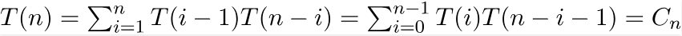

# 树的枚举

>如果一个二叉树的每个节点都被赋予了一个标签，则认为其为标记二叉树。若都没有被标记，
>则认为其为未标记二叉树。
 
    下图为两棵未标记二叉树，他们是相同的
        o                 o
      /   \             /   \ 
     o     o           o     o 

    下面两棵树不同两颗二叉树，他们是不同的
        A                C
      /   \             /  \ 
     B     C           A    B 

## n个节点能有多少种不同的未标记二叉树
    For n  = 1, there is only one tree
       o

    For n  = 2, there are two trees
       o      o
      /        \  
     o          o

    For n  = 3, there are five trees
        o      o           o         o      o
       /        \         /  \      /         \
      o          o       o    o     o          o
     /            \                  \        /
    o              o                  o      o

## 重要结论

> 例如, 用T(n)表示节点的数量
> T(0) = 1  [树为一个空树]
> T(1) = 1
> T(2) = 2
> 
> T(3) =  T(0)*T(2) + T(1)*T(1) + T(2)*T(0) = 1*2 + 1*1 + 2*1 = 5
> 
> T(4) =  T(0)*T(3) + T(1)*T(2) + T(2)*T(1) + T(3)*T(0)
>      =  1*5 + 1*2 + 2*1 + 5*1 
>      =  14 
>这个公式符合Catalan数(卡塔兰数)，前几个加泰罗尼亚数为1,1,2,5,14,132,429.........满足下面的公式  
>
>
>这里T(i-1)表示左子树的节点数  
>T(n-i-1)表示右子树的节点数
>第n个卡塔兰数也可以表示为：T(n) = (2n)! / (n+1)!n!  
>具有n个节点的二叉搜索树(BST)和同样具有n个节点未标记二叉树的数量一样多。

## n个节点能有多少种标记二叉树
>通过上面的公式我们能够很容易的计算出n个节点能构成不同未标记树的数量。
>对于标记树，每个未标记树能够创建n!不同的标记树通过赋予所有节点标签的排列组合。
>因此  
>标记树数量 = (未标记树数量) * n!
                       = [(2n)! / (n+1)!n!]  × n!
>例如 n = 3, 则有5 * 3! = 5*6 = 30 种不同的标记树
