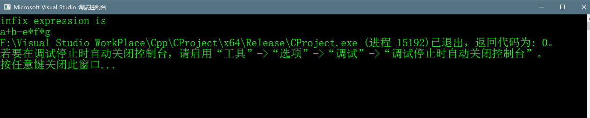

# 树表达式


## Abstract
> 表达式树是一个二叉树，其中每个内部节点对应于运算符，每个叶节点对应于操作数，
> 因此例如下图的表达式树将是3 +（（5 + 9）* 2）
> 
> 
> 
> 表达式的先序遍历：前缀表达式  
> 表达式的中序遍历：中缀表达式  
> 表达式的后序遍历：后缀表达式

## 表达式树的构建
> 我们使用Stack来构造表达式树，遍历输入的表达式。
> 1. 如果字符是一个操作数则push入栈
> 2. 如果字符是一个操作符，则从stack中pop两个值使得这两这个值作为这个操作符的
> 的两个子节点，之后将这个当前节点再次push入栈。
> 3. 堆栈中的最后结果就是表达式树的root节点


## c++ implement code
```c++
    // c++ program for expression tree
    #include <cstdlib>
    #include <iostream>
    #include <stack>
    #include <cstdio>

    using namespace std;
    // an expression tree node
    struct et {
    	char value;
    	et* left;
    	et* right;
    };

    //A utility function to check if 'c' is an operator
    bool isOperator(char c) {
    	if (c == '+' || c == '-' || c == '*' ||
    		c == '/' || c == '^') {
    		return true;
    	}
    	return false;
    }

    // inorder traversal
    void inOrder(et* et) {
    	if (et) {
    		inOrder(et->left);
    		printf("%c", et->value);
    		inOrder(et->right);
    	}
    }

    // create a new Node
    et* newNode(char value) {
    	et* newNode = new et;
    	newNode->value = value;
    	newNode->left = NULL;
    	newNode->right = NULL;
    	return newNode;
    }

    //construct a expression tree and return the root
    // the input is a postfix expression
    et* constructTree(char postfix[]) {
    	stack<et*> stack;
    	et *t, *operand1, *operand2;
    	//traverse through every character of input expression
    	for (int i = 0; i < strlen(postfix); i++)
    	{
    		//if operand,simple push into stack
    		if (!isOperator(postfix[i]))
    		{
    			//创建成一个节点push入栈
    			t = newNode(postfix[i]);
    			stack.push(t);
    		}
    		else // operator
    		{
    			t = newNode(postfix[i]);
    			//pop two element as node
    			operand1 = stack.top();
    			stack.pop();
    			operand2 = stack.top();
    			stack.pop();
    			//make them children
    			//这里一定要先右 再左边！！！不然会出现错误！！
    			t->right = operand1;
    			t->left = operand2;
    			//add this subexpression to stack
    			stack.push(t);
    		}
    	}
    	//遍历结束后，只剩下表达式树的根节点
    	et* root = stack.top();
    	stack.pop();
    	return root;
    }

    // Driver program to test above 
    int main()
    {
    	//输入一定要是个后缀表达式
    	char postfix[] = "ab+ef*g*-";
    	et* r = constructTree(postfix);
    	printf("infix expression is \n");
    	inOrder(r);
    	return 0;
    }
```


## 代码运行结果



