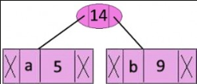
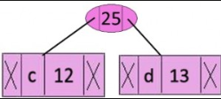
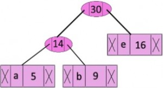
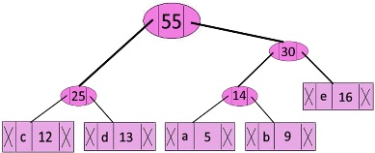
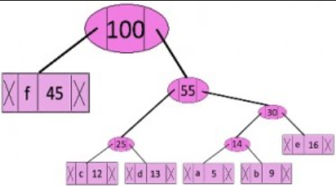
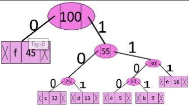
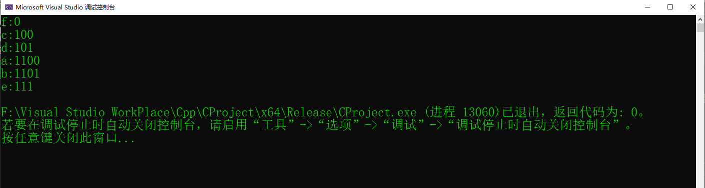

# Huffman Coding

> 前缀编码，意思是某种编码(比特流)被以某种方式分配，使得某个字符的编码并不是另外一个字符编码的前缀。
> 这就是为什么Huffman Coding能够确保在解码产生比特流的时候不会有歧义。  
> 有一个关于前缀编码的反例。  
> 假设有a,b,c,d四个字符，他们对应可变长编码00,01,0,1。这个编码将会引起歧义，因为字符c的编码是字符
> a和b的前缀。那么现在比如有一串编码为0001，解码输出为可能为"cccd","ccb","acb"或者是"ab"  
> 以下有两个关于Huffman Coding编码的主要部分
> 1. 从给定的输入字符中构建Huffman Tree
> 2.遍历Huffman Tree并为字符分配编码


## 建立Huffman Tree
> 输入一个独一无二的字符串和它们出现的次数，根据他们的出现频率从而构建Huffman Tree。
> 1. 为每个独一无二的字符创建一个叶子节点并且建立一个叶子节点的最小堆(最小堆是作为一个优先队列
> ，其值出现的频率常常用于比较最小堆中的两个节点，刚开始的时候，频率出现最低的是根节点)
> 2. 从最小堆中提取两个出现频率最低的节点
> 3. 创建一个频率等于两个节点频率之和的新内部节点，让第一个被提取出的节点作为左子节点，第二被提出的节点
> 作为新节点的右子节点。将这个新节点添加到最小堆中去。
> 4. 重复步骤2和步骤3直到最小堆中只剩下一个节点，则剩下的这一个节点就是根节点并且Huffman Tree构建完成


## 示例
    character   Frequency
        a            5
        b           9
        c           12
        d           13
        e           16
        f           45

##### step1. 包含6个节点其中每个节点都代表具有单个节点的树根，创建一个这样的最小堆。
##### step2. 提取两个频率最低的节点，用其创建一个新的内部节点，其值为两者频率之和，这里就是5 + 9 =14


> 现在最小堆包含了五个节点，其中4个节点是单元素树的根节点。并且有一个一堆为根的数，这个堆有三个元素。
> 
        character           Frequency
               c               12
               d               13
         Internal Node         14
               e               16
               f                45
               
##### step3. 再提取出现频率最低的两个字符，用其值的和创建一个新的内部节点，这里就是12 + 13 = 25

>现在最小堆包含四个节点，其中2个节点是单元素树的根节点。并且有两个以堆为根的树，这两个堆都分别有三个元素。
>
    character           Frequency
    Internal Node          14
           e               16
    Internal Node          25
           f               45

##### step4. 继续提取出现频率最低的两个字符，添加一个新的内部节点，值为频率和，这里就是14 + 16 = 30

>现在包含三个节点
>
    character          Frequency
    Internal Node         25
    Internal Node         30
          f               45 


##### step5. 继续提取出频率最低的字符，这里就是25 + 30 = 55


> 现在包含两个节点 
> 
    character     Frequency
           f         45
    Internal Node    55

##### step6. 最后一次提取两个频率最小的值，其频率和创建一个新节点，这里是45 + 55 = 100

> 现在只剩下一个节点，完成最小堆的构建，算法结束
> 
    character      Frequency
    Internal Node    100

##### step7. 从Huffman Tree中打印编码
> 从形成的树的根节点开始遍历，遍历左子树为0，右子树为1，直到叶子节点
> 

    
    character   code-word
        f          0
        c          100
        d          101
        a          1100
        b          1101
        e          111

## C++ 代码
```c++
    //c++ program for Huffman Code

#include <iostream> 
#include <cstdlib>
using namespace std;

//This constant define the max height of Huffman Tree
#define MAX_TREE_HT 100

//A Huffman Tree node
struct MinHeapNode{
	//输入的字符
	char data;
	//字符出现的频率
	unsigned int freq;
	//左右子树
	struct MinHeapNode* left,*right;
};

// 最小堆的结构体对象
struct MinHeap{
	//当前最小堆的大小
	unsigned size;
	//最小堆的容量
	unsigned capacity;
	//指向MinHeapNode节点数组的指针
	struct MinHeapNode** nodeArray; 
}; 

// create new MinHeapNode
struct MinHeapNode* newNode(char data,unsigned freq){
	struct MinHeapNode* newNode = 
			(struct MinHeapNode*)malloc(sizeof(struct MinHeapNode));
	newNode->left = NULL;
	newNode->data = data;
	newNode->right = NULL;
	newNode->freq = freq;
	return newNode;
} 

//malloc memory for a MinHeap struct Object
struct MinHeap* createMinHeap(unsigned capacity){
	struct MinHeap* minHeap =
	 		(struct MinHeap*) malloc(sizeof(struct MinHeap));
	 		
	//current size is 0
	minHeap->size = 0;
	minHeap->capacity = capacity;
	minHeap->nodeArray = 
	(struct MinHeapNode**)malloc(minHeap->capacity * sizeof(struct MinHeapNode));
	return minHeap;
}

//交换两个最小堆节点
void swapMinHeapNode(struct MinHeapNode** a,struct MinHeapNode** b) {
	struct MinHeapNode* t = *a;
	*a = *b;
	*b = t; 
} 

//生成最小堆
void  minHeapify(struct MinHeap* minHeap,int idx){
	int smallest = idx;
	int left = 2 * idx + 1;
	int right = 2 * idx + 2; 
	
	if ((left < minHeap->size) && (minHeap->nodeArray[left]->freq) <
	 (minHeap->nodeArray[smallest]->freq)){
	 	smallest = left;
	 }
	 
	if(right < minHeap->size && minHeap->nodeArray[right]->freq < 
	minHeap->nodeArray[smallest]->freq){
		smallest = right;
	}
	
	if(smallest != idx){
		swapMinHeapNode(&minHeap->nodeArray[smallest],
		&minHeap->nodeArray[idx]);
		minHeapify(minHeap,smallest);
	}
} 

//用于检查heap的size是否为1
int isSizeOne(struct MinHeap* minHeap) {
	return (minHeap->size == 1);
}

//a function to extract minimum value node from heap
struct MinHeapNode* extractMin(struct MinHeap* minHeap) {
	//把节点数组的一个节点赋予temp 
	struct MinHeapNode* temp = minHeap->nodeArray[0];
	minHeap->nodeArray[0]  = minHeap->nodeArray[minHeap->size - 1];
	//自减 1
	(minHeap->size)--;
	minHeapify(minHeap,0);
	return temp;
} 

//在最小堆中插入一个节点
void insertMinHeap(struct MinHeap* minHeap,struct MinHeapNode* minHeapNode) {
	//插入一个节点后 size自增1
	(++minHeap->size);
	int i = minHeap->size - 1;
	while(i != 0 && (minHeapNode->freq < minHeap->nodeArray[(i-1)/2]->freq)){
		minHeap->nodeArray[i] = minHeap->nodeArray[(i-1)/2];
		i = (i-1)/2;
	}
	minHeap->nodeArray[i] = minHeapNode;
}

//建立最小堆的方法 
void buildMinHeap(struct MinHeap* minHeap) {
	int n = minHeap->size - 1;
	int i;
	for(i = (n-1)/2;i >= 0;i--){
		minHeapify(minHeap,i);
	}
}

//判断节点是否为叶子节点
int isLeaf(struct MinHeapNode* root) {
	return (!(root->left) && !(root->right));
}

//调用方法创建最小堆，根据给定的字符和其频率，还有size
//初始化时其capacity 等于size 
struct MinHeap* createAndBuildMinHeap(char data[],int freq[],int size) {
	struct MinHeap* minHeap = createMinHeap(size);
	for(int i = 0;i < size;i++) {
		 minHeap->nodeArray[i] = newNode(data[i], freq[i]); 
	}
	minHeap->size = size;
	buildMinHeap(minHeap);
	return minHeap;
}

//构建Huffman tree
struct MinHeapNode* buildHuffmanTree(char data[],int freq[],int size) {
	struct MinHeapNode*left,*right,*top;
	
	//step1:创建一个capacity为size 的最小堆
	struct MinHeap* minHeap = createAndBuildMinHeap(data,freq,size) ;
	//迭代堆，直到这个堆为1(或者说只要这个这个堆的大小不为1就一直迭代) 
	while(!isSizeOne(minHeap)) {
		//step2:提取两个freq最小作为left,right节点
		left = extractMin(minHeap);
		right = extractMin(minHeap);
		//step3:用两个freq的和创建一个内部节点
		//让这个两个节点作为这个和的左右结点
		//'$'这个符号作为节点的值
		top = newNode('$',left->freq+right->freq);
		top->left = left;
		top->right = right;
		insertMinHeap(minHeap,top);
	}
	//step4:余下的节点是树的根节点，并且已经完成Huffman Tree的构建
	return extractMin(minHeap);
}

//打印数组
void printArr(int arr[],int n) {
	int i;
	for(i =0;i < n; ++i){
	 	cout << arr[i];
	}
	cout << "\n";
}

//从树的root开始打印Huffman code
//这里使用数组arr[]存储编码
void printCodes(struct MinHeapNode* root,int arr[],int top){
	//assign 0 to left edge and recursion
	if(root->left) {
		arr[top] = 0;
		printCodes(root->left,arr,top+1);
	}
	
	// Assign 1 to right edge and recur 
	if (root->right) {

		arr[top] = 1;
		printCodes(root->right, arr, top + 1);
	}

	//如果这是个叶子节点，打印出他的值
	if(isLeaf(root)) {
		cout << root->data << ":";
		printArr(arr,top);
	}
} 
 
//给定数据创建Huffman Tree,并打印编码 
void HuffmanCodes(char data[], int freq[], int size) 
  
{ 
    // Construct Huffman Tree 
    struct MinHeapNode* root 
        = buildHuffmanTree(data, freq, size); 
  
    // Print Huffman codes using 
    // the Huffman tree built above 
    int arr[MAX_TREE_HT], top = 0; 
  
    printCodes(root, arr, top); 
} 

int main(){
	 char arr[] = { 'a', 'b', 'c', 'd', 'e', 'f' }; 
    int freq[] = { 5, 9, 12, 13, 16, 45 }; 
    int size = sizeof(arr) / sizeof(arr[0]); 
    HuffmanCodes(arr, freq, size);
	 
    return 0; 
}


```


## 代码运行结果
