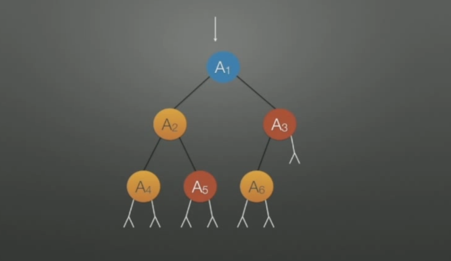

# Index Binary Tree


## 线索二叉树（中序）
> 二叉树的遍历就是把一个分支结构变成一个线性结构。
> 


##  连接规则
1. 如果一个节点有左空指针则其左空指向前驱。
2. 如果一个节点有右空指针则其右空指向后继。


## 变成中序的线索二叉树
> 在遍历二叉树过程中把二叉节点中的空指针指向合适的位置。中序遍历上面的二叉树  
> 1. A4、A2（A4是A2的前驱，A2是A4的后继），把A4右边的空指针指向A2(根据规则2)
> 
> 
> 
> 2. 继续遍历A4、A2、A5(A5是A2的后继，A2是A5的前驱，所以A5的左空指针指向A2)
> 
> 
> 
>3. 继续遍历A4、A2、A5、A1(A1为A5的后继)，所以A5的右空指针指向A1。
>
>
>
>4. A4、A2、A5、A1、A6(A1是A6的前驱)，所以A6的左空指向A1
>
>
>
>5. A4、A2、A5、A1、A6、A3(A3是A6的后继)，所以A6的右空指针指向A3.
>
>
>
>6. 遍历结束，A4没有前驱，A3没有后继，所以没有A4的左空指针没有指向其他节点，A3的有空也没有指向其他节点。

## 存储结构
> 由于左右指针有不同的功能(1. 指向子节点 2.指向前驱或后继)，这样就无法分清到底是指向子节点还是
> 其前驱或后继节点。所以其原本的结构就不能用了。
```c++

    typedef struct Node{
         int data;
         Node* left;
         Node* right;
    }Node;
    
```

其新存储节点应该如下

```c++
    typedef struct Node{
        int data;
        int lTag;
        int rTag;
        Node* left;
        Node* right;
    }Node;
```
>当lTag为0时候，left指针指向的是左子节点。lTag为1的时候，其表示指向前驱，
>同理，rTag也是一样。
>上面那棵线索二叉树的存储结构如下：
>

>
##  二叉树中序线索化的代码


### 执行步骤自行带入，不赘述，太多了截不了图

## 补充知识
### 1. 如何找到遍历序列中的第一个节点
> 显然，第一个节点就是从根节点一直向左走，走到顶端的节点。
### 2. 如何找到遍历序列中最后一个节点
> 和找第一个节点类似，只要向右走，走到顶端。
### 3. 如何找到某个节点的后继节点
> * 如果对于一个节点如果有后继节点，并且其右指针是线索，那么线索所指向的节点就是后继节点。
> * 如果对于一个节点的右指针不是线索，则从这个节点向右走一步，然后再走到最左端的节点就是其后继节点。
### 4. 如何找到某个节点的前驱节点 
> * 如果对于一个节点有前驱节点，并且其左指针是线索，那么线索指针的节点就是前驱节点
> * 如果对于一个节点的左指针不是线索，则向左走一步，然后再走到最右端的节点就是其前驱节点。

