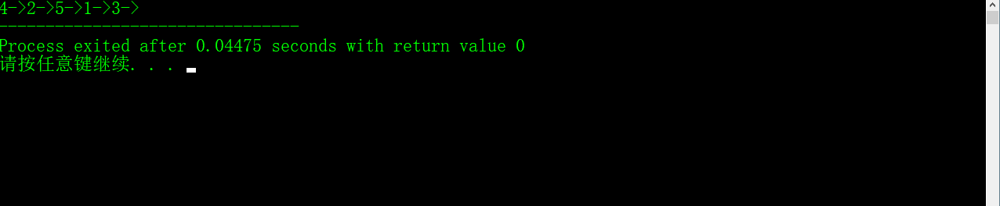

# Inorder Traversal Using Stack

## Abstact
>使用栈是一个是除了递归方法以外的方法。
>1. 创建一个空stack
>2. 初始化当前作为根节点
>3. 将当前节点push入栈并且设置current = current->left直到current为NULL(若curr为空将执行下面的语句)
>4. 如果current为NULL并且stack不为空  
>    则1. 从栈中pop出栈顶的项目
>       2. 打印popped项目，设置current = popped_item->right
>       3. 返回第三步骤
> 5. 如果current为NULL并且stack为空，完成
>
>## 考虑以下过程
                1
              /   \
            2      3
          /  \
        4     5

    Step 1 Creates an empty stack: S = NULL

    Step 2 sets current as address of root: current -> 1

    Step 3 Pushes the current node and set current = current->left until current is NULL
         current -> 1
         push 1: Stack S -> 1
         current -> 2
         push 2: Stack S -> 2, 1
         current -> 4
         push 4: Stack S -> 4, 2, 1
         current = NULL

    Step 4 pops from S
         a) Pop 4: Stack S -> 2, 1
         b) print "4"
         c) current = NULL /*right of 4 */ and go to step 3
    Since current is NULL step 3 doesn't do anything. 

    Step 4 pops again.
         a) Pop 2: Stack S -> 1
         b) print "2"
         c) current -> 5/*right of 2 */ and go to step 3

    Step 3 pushes 5 to stack and makes current NULL
         Stack S -> 5, 1
         current = NULL

    Step 4 pops from S
         a) Pop 5: Stack S -> 1
         b) print "5"
         c) current = NULL /*right of 5 */ and go to step 3
    Since current is NULL step 3 doesn't do anything

    Step 4 pops again.
         a) Pop 1: Stack S -> NULL
         b) print "1"
         c) current -> 3 /*right of 5 */  

    Step 3 pushes 3 to stack and makes current NULL
         Stack S -> 3
         current = NULL

    Step 4 pops from S
         a) Pop 3: Stack S -> NULL
         b) print "3"
         c) current = NULL /*right of 3 */  

    Traversal is done now as stack S is empty and current is NULL.


## C++代码
```c++
    // C++ program to print inorder traversal 
    // using stack

    #include<iostream>
    #include<stack>
    #include<cstdlib>
    #include<cstdio>

    using namespace std;
    //a binary tree node
    struct Node{
    	int data;
    	struct Node* left;
    	struct Node* right;
    	Node(int data){
    		this->data = data;
    		left = right = NULL; 
    	}
    };

    //iterative function for inorder tree taversal
    void inOrder(struct Node* root){
    	stack<Node*> stack;
    	Node* curr = root;
    	//如果curr不为NULL或者stack不为空 
    	while(curr != NULL || !stack.empty()){
    		//让curr指向left的最深处,将这所有的左节点
    		//都放入到stack中 
    		while(curr != NULL) {
    			stack.push(curr);
    			curr = curr->left;
    		}
    		//curr must be NULL at this step
    		curr = stack.top();
    		stack.pop();
    		cout << curr->data << "->";
    		
    		//we have visited the node and its left
    		//subtree,now,it's right subtree's turn 
    		
    		curr = curr->right;
    	}
    }

    Node* newNode(int data){
    	struct Node* newNode  = (struct Node*)(malloc(sizeof(struct Node)));
    	newNode->data = data;
    	newNode->right = NULL;
    	newNode->left = NULL;
    	return newNode;
    }

    int main(){
    	struct Node* root = newNode(1);
    	root->left = newNode(2);
    	root->right = newNode(3);
    	root->left->left = newNode(4);
    	root->left->right = newNode(5);
    	  /* Constructed binary tree is 
                  1 
                /   \ 
              2      3 
            /  \ 
          4     5 
        */
    	inOrder(root);
    } 

```

## 代码运行结果

