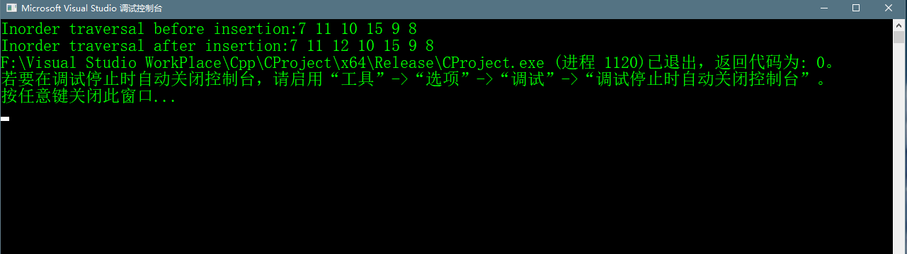

# 按水平顺序插入节点

## Abstract 
> 给定一个二叉树，按层顺序插入一个键到二叉树第一个可用的位置。如下图:
> 
> 

## 思路
>一个思路就是使用队列遍历按层级顺序遍历给定的树，如果我们找到一个节点的左子树是空的，
>则创建一个新的节点作为左节点，else if 我们找到一个节点的右子树是空的，我们创建一个节点
>作为树的右节点。我们一直遍历树直到找到一个节点左节点或右节点为空。


## C++ 代码

```c++
    // c++ program to insert element in bynary tree
    #include <iostream>
    #include <queue>
    #include <cstdlib>

    using namespace std;

    /*a bianry tree node has key,pointer to lefet
    and a pointer to right child*/

    struct Node
    {
    	int key;
    	struct Node* left, *right;
    };

    /*the function to create a new node of tree and return
    poiter*/
    struct Node* newNode(int key) {
    	struct Node* temp = (struct Node*)malloc(sizeof(struct Node));
    	//下面这句也行
    	//struct Node* temp = new Node; 
    	temp->key = key;
    	temp->left = temp->right = NULL;
    	return temp;
    }

    //Inorder traversal of a binary tree 中序遍历
    void inOrder(struct Node* node) {
    	if (!node)
    	{
    		//cout << "the node is NULL" << endl;
    		return;
    	}
    	inOrder(node->left);
    	cout << node->key << " ";
    	inOrder(node->right);
    }

    //function to insert element in biary tree
    void insert(struct Node* node, int key) {
    	queue<Node*> queue;
    	/*
    	  push(x) 将x压入队列的末端
    	  pop() 弹出队列的第一个元素(队顶元素)，注意此函数并不返回任何值
    	  front() 返回第一个元素(队顶元素)
    	  back() 返回最后被压入的元素(队尾元素)
    	  empty() 当队列为空时，返回true
    	  size() 返回队列的长度
    	*/
    	queue.push(node);
    	//do level order traversal until we find an empty place
    	while (!queue.empty()) 
    	{
    		cout << "一次";
    		struct Node* temp = queue.front();
    		queue.pop();
    		//if left child is null,then insert a new node
    		if (!temp->left)
    		{
    			temp->left = newNode(key);
    			break;
    		}
    		else
    		{
    			queue.push(temp->left);
    		}

    		if (!temp->right)
    		{
    			temp->right = newNode(key);
    			break;
    		}
    		else
    		{
    			queue.push(temp->right);
    		}
    	}

    } 


    // Driver code 
    int main()
    {
    	struct Node* root = newNode(10);
    	root->left = newNode(11);
    	root->left->left = newNode(7);
    	root->right = newNode(9);
    	root->right->left = newNode(15);
    	root->right->right = newNode(8);

    	cout << "Inorder traversal before insertion:";
    	inOrder(root);

    	int key = 12;
    	insert(root, key);

    	cout << endl;
    	cout << "Inorder traversal after insertion:";
    	inOrder(root);

    	return 0;
    }

```


## 代码运行结果
