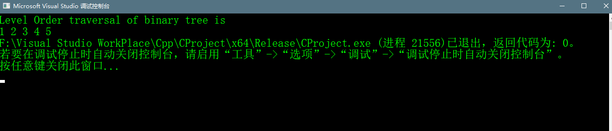

# 树的层级遍历

## Abstract
> 树的层级顺序遍历是树的广度优先遍历。
> 
> 
> 
> 其层级遍历是1,2,3,4,5

## 思路
> 实现这个功能需要两个基础的功能，一个打印在给定的层级中所有结点，另一个就是按层级顺序遍历树。
> 在printLevelOder中使用printGivenLevel从树的root开始一个接一个的打印出每个层级的结点。
> 

    //按树的层级遍历的方法
    printLevelOrder(tree)
    for d = 1 to height(tree)
        printGivenLevel(tree,d);
        
    //打印出每层的所有结点
    printGivenLevel(tree,d)
        if(tree is NULL) then
                  return;
        if level == 1 then
                    print(tree->data);
        else{
         printGivenLevel(tree->left, level-1);
         printGivenLevel(tree->right, level-1);
       }


## C++代码实现

```c++
    //对于层级顺序递归遍历二叉树的CPP 程序

    #include<cstdlib>
    #include<iostream>

    using namespace std;


    //a binary node,include data,pointer to left child and
    //a pointer to right child
    class node {
    public:
    	int data;
    	node* left, *right;

    };

    //打印给定层级的节点
    void printGivenLevel(node* root, int level);
    //按层级顺序遍历节点
    void printLevelOrder(node* root);
    //返回高度
    int height(node* node);
    //创建一个新节点并返回它的指针
    node* newNode(int data);

    //打印指定层数的所有节点
    void printGivenLevel(node * root, int level)
    {
    	if (root == NULL) {
    		return;
    	}if (level == 1)
    	{
    		cout << root->data << " ";
    	}
    	else if(level > 1)
    	{
    		printGivenLevel(root->left, level - 1);
    		printGivenLevel(root->right, level - 1);
    	}
    }

    int height(node * node)
    {
    	if (node == NULL)
    	{
    		return 0;
    	}
    	else
    	{
    		//计算每个子树的高度
    		int lheight = height(node->left);
    		int rheight = height(node->right);
    		//哪个子树的高度大就说明树高度为哪个
    		if (lheight > rheight) {
    			return lheight + 1;
    		}
    		else
    		{
    			return rheight + 1;
    		}
    	}
    }

    node * newNode(int data)
    {
    	
    	node* newNode = new node();
    	newNode->data = data;
    	newNode->left = NULL;
    	newNode->right = NULL;
    	return newNode;
    }

    void printLevelOrder(node* root)
    {
    	int h = height(root);
    	int i;
    	for (int i = 1; i <= h; i++)
    	{
    		printGivenLevel(root, i);
    	}
    }

    int main() {
    	node* root  = newNode(1);
    	root->left = newNode(2);
    	root->right = newNode(3);
    	root->left->left = newNode(4);
    	root->left->right = newNode(5);
    	cout << "Level Order traversal of binary tree is\n";
    	printLevelOrder(root);
    	return 0;
    }

```

## 代码运行结果


