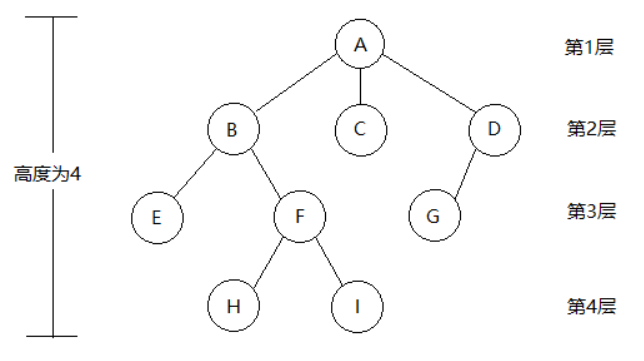
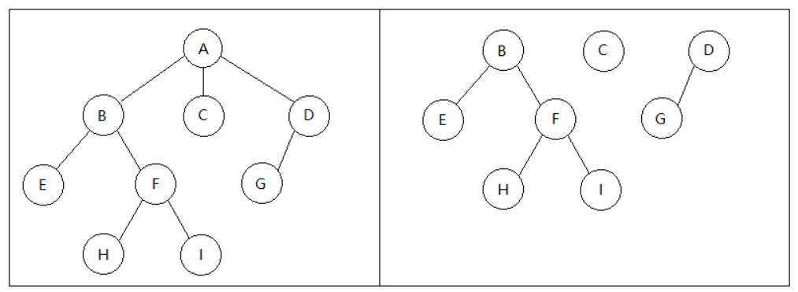

# Tree

## Abtract
>树是N(N≥0)个结点的有限结构。N=0时，称为空树。这是一种特殊情况。在任意一个非空树中应满足：
>1. 有且仅有一个特定的称为根的结点；
>2.当(N>1)时，其余结点可分为m(m>0)个互不相交的有限结合{T1,T2,...,Tm}，
>其中每一个结合本身又是一棵树，并且称为根结点的子树。

>显然树的定义是一种递归的数据结构，同时树也是一种分层的结构，具有以下两个特点：
>1.树的跟结点没有前驱结点，除根结点之外的所有节点有且仅有一个前驱结点；
>2.树中所有结点可以有零个或多个后继结点。

## 基本术语
> 1. 结点的度：树中一个结点的子结点个数称为该结点的度；
> 2. 树的度：一棵树中，最大的结点的度称为树的度；
> 3. 分支结点或非终端结点：度不为0的结点；
> 4. 叶子结点或终端结点：度为0的结点称为叶子结点；
> 5. 双亲结点或父结点：若一个结点含有子结点，则这个结点称为其子结点的父结点；
> 6. 孩子结点或子结点：一个结点含有的子树的根结点称为该结点的子结点；
> 7. 兄弟结点：具有相同父结点的结点互称为兄弟结点；
> 8. 结点的祖先：从根到该结点所经分支上的所有结点；
> 9. 子孙结点：以某结点为根的子树中任一结点都称为该结点的子孙结点；
> 10. 结点的层次：从根开始定义起，根为第1层，根的子结点为第2层，以此类推；
> 11. 树的高度或深度：树中结点的最大层次；
> 12. 有序树：树中结点的子树自左向右是有次序的，不能交换，这样的树叫做有序树；
> 13. 无序树：树中结点的子树左右顺序并不相关联，即可以左右子树交换；
> 14. 路径：树中两个节点之间的路径是指由两个结点之间所经过的结点序列；
> 15. 路径长度：路径上所经过的边的个数；

> 1. 从结点A到结点H的唯一路径上的所有结点，称为H的**祖先结点**，如结点B，结点F；而结点H则为结点B的**子孙结点**；路径上最接近H的结点F称为H的**双亲结点**，而H为结点F的**孩子结点**；结点A是树中唯一没有双亲的结点，所以称为根结点。有相同双亲的结点称为兄弟结点，如结点H和结点I。
> 2. 树中一个结点的子结点个数称为该**结点的度**，树中结点的最大度数称为树的度；如结点B的度为2，而树的度为3。
> 3. 度大于0的结点称为**分支节点**，如结点B；度为0的结点称为**叶子结点**，如结点H和结点I；在分支结点中，每个结点的分支数就是该结点的度，如结点B的分支数为2，故结点B的度为2。
> 4. **结点的层次**是从树的根节点开始定义的，根结点为第1层（注：有些教材中定义为第0层），它的孩子结点为第2层，依次类推…比如结点A位于第1层。
> 5. **结点的深度**是从根结点开始自顶向下累加的，如图中H结点的深度是4。
> 6. **结点的高度**是从叶子结点开始自底向上累加的，如图中A结点的高度是4。
> 7. **树的高度**（又称深度）是树种结点的最大层数，如图中所示树的高度是4。
> 8. **路径和路径长度**：结点A和结点H的路径长度是3，中间经过结点B和结点F。

## 性质

> 树中的结点数等于所有结点的度数加1；
> 度为m的树中，第i层上至多有m^(i−1)^个结点(i≥1)；
> 高度为h的m叉树至多有(m^h−1)/(m−1)个结点；
> 具有n个结点的m叉树的最小高度为logm(n(m−1)+1) ，第一个m为下标

## 森林
> 森林：由m（m≥0）棵互不相交的树的集合称为森林。
> 森林与树的概念与树的概念十分相近，因为只要把树的根结点删去就成了森林。反之，只要给m棵独立的树加上一个结点，并把这m棵树作为该结点的子树，则森林就变成了树。

