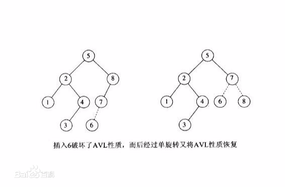
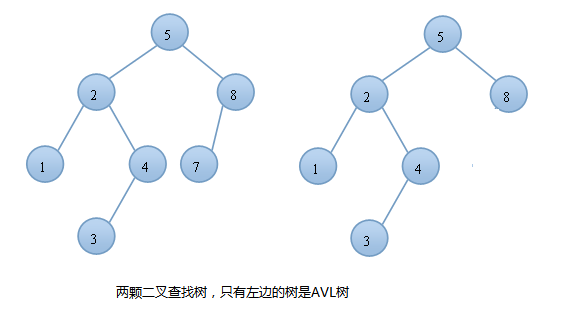

# 二叉树的类型

## 满二叉树
>判断一个二叉是满的，只要看它的节点的度，如果每个节点只要0个或2个孩子，则认为它是满二叉树。
>或者说除了叶子节点以外的所有节点都有两个孩子，则认为他是满二叉树。
>
                     18
                   /     \  
                 15       30  
                /  \      /  \
              40    50  100   40

                 18
               /    \   
             15     20    
            /  \       
          40    50   
        /   \
       30    50

               18
            /     \  
          40       30  
                   /  \
                 100   40

>在一个满二叉树中，叶子节点的数量是其内部节点的数量加1。
>即L = I + 1，其中L = 叶子节点数量，I = 内部节点的数量

## 完全二叉树
>如果一个二叉树除了最后一个之外的每一层，并且最后一层的结束节点只有一个时为左节点，称为完全二叉树。如下图
>
               18
           /       \  
         15         30  
        /  \        /  \
      40    50    100   40

               18
           /       \  
         15         30  
        /  \        /  \
      40    50    100   40
     /  \   /
    8   7  9 
>所以一个满二叉树一定是完全二叉树，但一个完全二叉树不一定是满二叉树
## 完美二叉树
>如果叶子节点都在同一层，并且内部节点都有两个子节点的二叉树称为完美二叉树

                      18
                   /       \  
                 15         30  
                /  \        /  \
              40    50    100   40

               18
            /       \  
          15         30 

>一个完美二叉树的高度h(高是指从根到叶子节点的节点数)，其有(2^h)-1个节点

## 平衡二叉树
>它是一棵空树或它的左右两个子树的高度差的绝对值不超过1，并且左右两个子树都是一棵平衡二叉树。
>树的查找、删除、插入时间复杂度都是O(Log n)，其中n为节点的数量。例如AVL树通过确保左右子树
>的高度之差为1来维持O（Log n）高度。红黑树也可以在O(log n)时间内做查找，插入和删除，
>这里的n 是树中元素的数目。
>
>
>
>
>
>

## 退化树(pathological 树)
>一个树其内部节点都只有一个子节点，那么他的运行性能和一个链表一样
>
         10
          /
        20
         \
         30
          \
          40     
