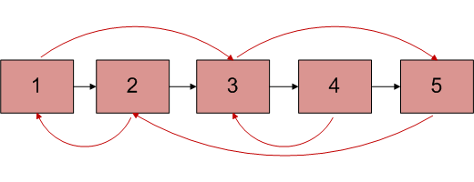

# Clone a linked list with next and random pointer

> 给定一个DLL，DLL中的节点有一个指针指向下一个节点，就像单链表一样。第二个指针指向链表中的任意一个节点，而不仅仅是只指向前一个
> 节点。现在写一个时间复杂度为O(n)的方法，这个方法的功能是对该链表进行复制。我们称呼这个第二个指针为arbit指针，他能指向链表中的任意
> 一个节点。如下图

