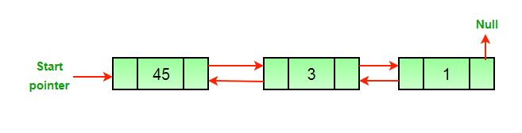

# Delete a node in DLL

>初始化DLL之后，DLL的结构如下图所示
>
>

> 删去头结点后的DLL
> 
> 

>再去删去一个节点后的DLL
>
>

> 只剩下最后一个节点
> 
> 

## 解决思路
> 传入要删除的节点del
>1. 如果要删去的节点是的头结点，则将头指针指向头结点的next指针指向的元素
>2. 设置

## 部分代码

```c++
    void deleteNode(Node ** head_ref, Node * del)
    {

    	if (*head_ref == NULL || del == NULL) {
    		return;
    	}

    	//if node to be deleted is head node
    	if (*head_ref == del)
    	{
    		*head_ref = del->next;
    	}

    	//if node to be deleted is not last node change next
    	if (del->next != NULL)
    	{
    		del->next->prev = del->next;
    	}
    	//if node to be deleted is not the first node chage prev
    	if (del->prev != NULL)
    	{
    		del->prev->next = del->next;
    	}

    	//finally,free the memory occupied by del
    	free(del);
    	return;
    }
```