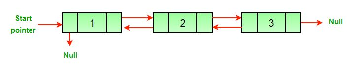

# Reverse a Doublely Linked List

> 给定一个DLL，写一个方法倒置DLL

> 如下图一个初始化的DLL

> 

>经过倒置后，使得DLL成如下形式

>

> 有一个简单的方法用于倒置一个DLL，我们只需要将DLL中所有节点的prev指针和next指针交换即可，再把
> 头指针指向原来的尾部，头结点的prev设为NULL即可。

## 主要代码如下

```c++
    void reverseDLL(Node ** head_ref)
    {
    	struct Node* temp = NULL;
    	struct Node* current = *head_ref;
    	//swap next pointer and prev pointer
    	//for all nodes of DLL
    	while (current != NULL)
    	{
    		temp = current->prev;
    		current->prev = current->next;
    		current->next = temp;
    		//指针向下移动一个节点
    		current = current->prev;
    	}
    	//before changing head,check for the cases
    	//like empty list and list with only one node
    	if (temp != NULL)
    	{

    		*head_ref = temp->prev;
    	}

    }
```
