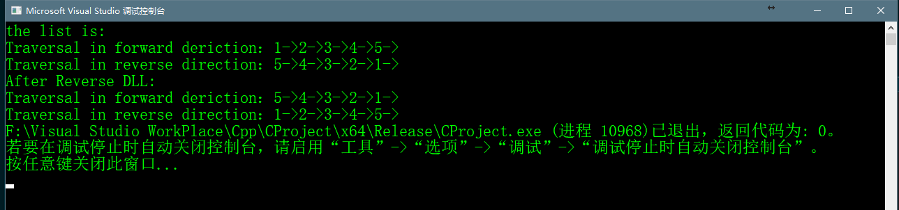
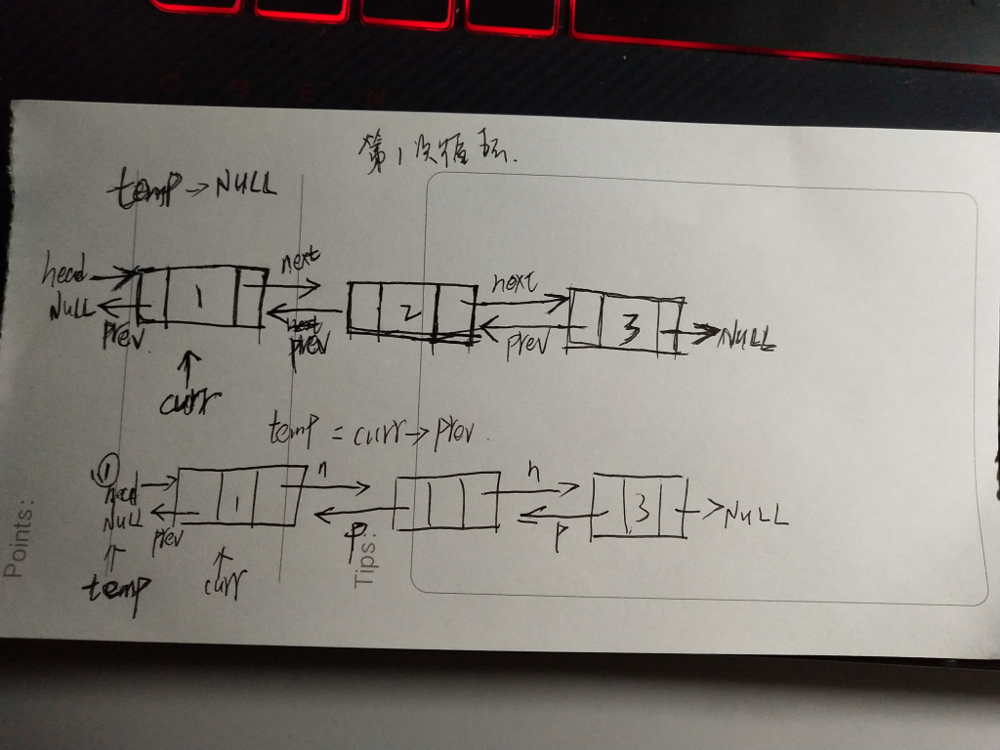
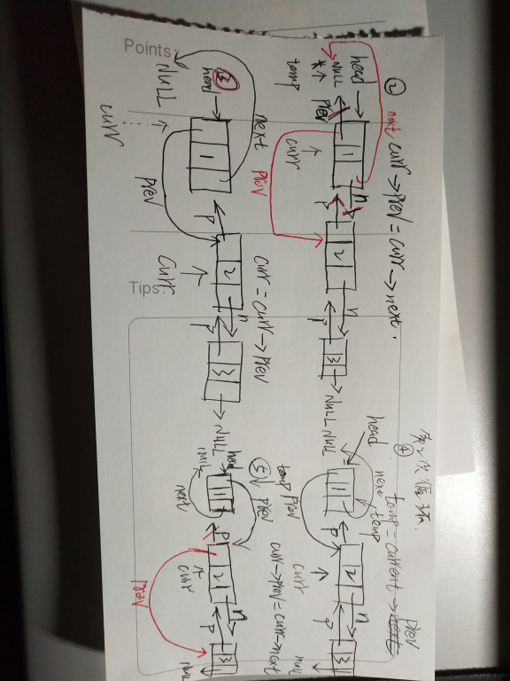
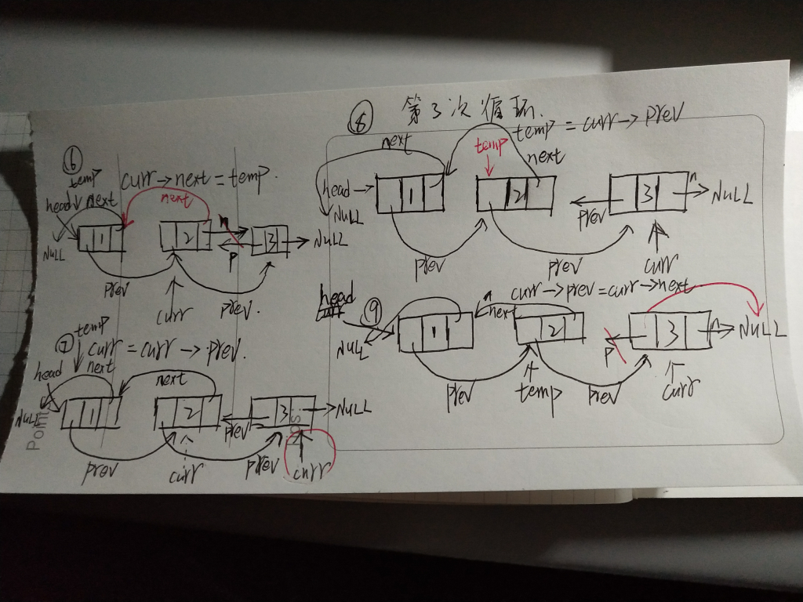
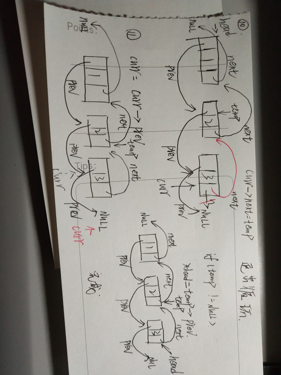

# Reverse a Doublely Linked List

> 给定一个DLL，写一个方法倒置DLL

> 如下图一个初始化的DLL

> 

>经过倒置后，使得DLL成如下形式

>

> 有一个简单的方法用于倒置一个DLL，我们只需要将DLL中所有节点的prev指针和next指针交换即可，再把
> 头指针指向原来的尾部，头结点的prev设为NULL即可。

## 主要代码如下

```c++
    void reverseDLL(Node ** head_ref)
    {
    	struct Node* temp = NULL;
    	struct Node* current = *head_ref;
    	//swap next pointer and prev pointer
    	//for all nodes of DLL
    	while (current != NULL)
    	{
    		temp = current->prev;
    		current->prev = current->next;
    		current->next = temp;
    		//指针向下移动一个节点
    		current = current->prev;
    	}
    	//before changing head,check for the cases
    	//like empty list and list with only one node
    	if (temp != NULL)
    	{

    		*head_ref = temp->prev;
    	}

    }
```

## 完整代码

```c++
    #include<iostream>
    #include<cstdlib>
    #include<cstdio>

    using namespace std;

    //insert a new node on the front of the list
    void push(struct Node** head_ref, int data);
    //print the content of the list
    void printList(struct Node* head);
    //reverse a DLL
    void reverseDLL(struct Node** head_ref);

    struct  Node
    {
    	int data;
    	struct Node* next;
    	struct Node* prev;
    };

    void printList(struct Node* head) {
    	struct Node* head_node = head;
    	//指向尾节点的指针
    	struct Node* last_node = NULL;
    	//正向打印
    	printf("Traversal in forward deriction：");
    	while (head_node != NULL)
    	{
    		printf("%d->", head_node->data);
    		//这条语句要写在这里不能写在下面那条语句之后，因为最后一次执行循环完之后的head_node的next
    		//指针指向的是NULL，last_node如果写在之后将是NULL
    		last_node = head_node;
    		head_node = head_node->next;
    	}
    	printf("\n");
    	//逆向打印
    	printf("Traversal in reverse direction：");
    	while (last_node != NULL)
    	{
    		printf("%d->", last_node->data);
    		last_node = last_node->prev;
    	}
    }

    void push(struct Node** head_ref, int newData) {
    	//1.allocae memory
    	struct Node* new_node = (struct Node*)malloc(sizeof(struct Node));
    	int size = sizeof(struct Node);
    	//2.put int the data
    	new_node->data = newData;
    	//3. make the next of new node as head and previous as NULL
    	new_node->next = *head_ref;
    	new_node->prev = NULL;

    	//4.change prev of head node to new node
    	if ((*head_ref) != NULL)
    	{
    		(*head_ref)->prev = new_node;
    	}

    	//5.move the head to point to the new node
    	*head_ref = new_node;
    }

    int main() {

    	struct Node* head = NULL;
    	push(&head, 5);
    	push(&head, 4);
    	push(&head, 3);
    	push(&head, 2);
    	push(&head, 1);
    	printf("the list is:\n");
    	printList(head);

    	printf("\n");
    	reverseDLL(&head);
    	printf("After Reverse DLL:\n");

    	printList(head);
    }


    void reverseDLL(Node ** head_ref)
    {
    	struct Node* temp = NULL;
    	struct Node* current = *head_ref;
    	//swap next pointer and prev pointer
    	//for all nodes of DLL
    	while (current != NULL)
    	{
    		temp = current->prev;
    		current->prev = current->next;
    		current->next = temp;
    		//指针向下移动一个节点
    		current = current->prev;
    	}
    	//before changing head,check for the cases
    	//like empty list and list with only one node
    	if (temp != NULL)
    	{

    		*head_ref = temp->prev;
    	}

    }
```

## 程序运行效果


## 步骤详解







## 分析
>该倒置的方法即把DLL中所有的节点的prev指针和next指针交换指向的节点即可。值得解释的是，在循环中语句的循序如下：

```c++
    while(current != NULL){
            temp = current->prev;
    		current->prev = current->next;
    		current->next = temp;
    		//指针向下移动一个节点
    		current = current->prev;
		}
		//before changing head,check for the cases
    	//like empty list and list with only one node
    	if (temp != NULL)
    	{

    		*head_ref = temp->prev;
    	}
```
>如果改变了上面语句的循序，先交换next节点，即如下语句

```c++
    while(current != NULL){
            temp = current->next
            current->next = current->prev;
            current->prev = temp;
            //指针向下移动一个节点
            current = current->prev
        }
        *head_ref = current;
```
>由于循环语句的结束条件是current != NULL，所以当循环条件退出的时候，那么此时的current指针必然指向一个NULL
>所以此时最后一句*head_ref = current是不运行的，所以程序在打印的时候会出错。
>正确的修改方式如下，记录下每次的节点，直到循环退出的时候则该将头指针指向最后一个节点。代码如下

```c++
    void reverseDLL(Node ** head_ref)
    {
    	struct Node* temp = NULL;
    	struct Node* current = *head_ref;
    	struct Node* last = NULL;
    	//swap next pointer and prev pointer
    	//for all nodes of DLL
    	while (current != NULL)
    	{
    		temp = current->next;
    		current->next = current->prev;
    		current->prev = temp;
    		last = current;
    		//指针向前移动一个节点
    		current = current->prev;
    	}
    	//before changing head,check for the cases
    	//like empty list and list with only one node
    	if (last != NULL)
    	{
    		*head_ref = last;
    	}

}
```


