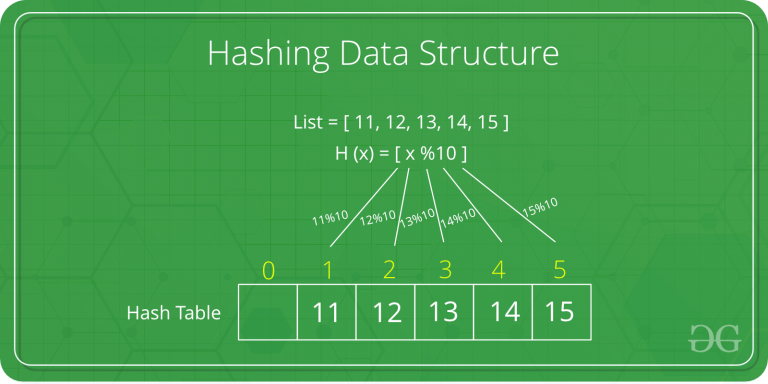

# Hashing Data Structure

## Introduce

>Hashing 是用于设计一种名为Hash Function这种特殊方法的重要数据结构，
>Hash Function用于将给定的值与特定的键印射，以便于快速的访问元素。
>其中印射的效率取决于所使用的Hash Function的效率。  
>例如让一个Hash Function H(x)，让值x的印射对应于一个数组，数组的下标取决于值x % 10。
>例如有一个list其值为[11,12,13,14,15],他们将分别存储与数组中{1,2,3,4,5}的位置中。

