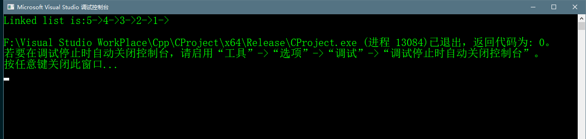
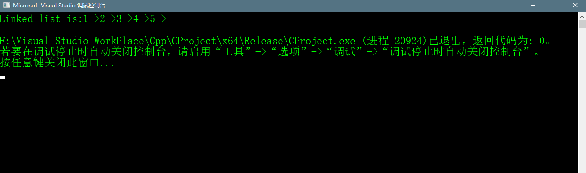
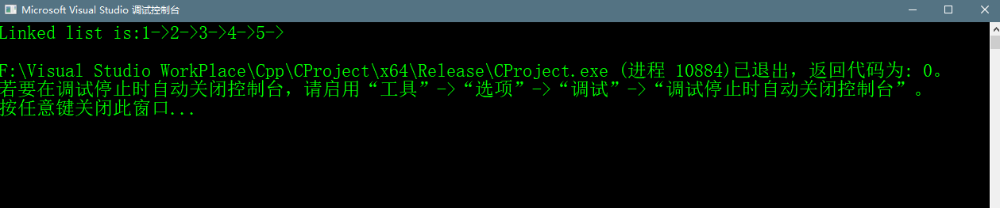

# Linked List Insertion_4


## Abstract 
> 此文在上篇文章的基础上讲述如何在一个Linked List中插入一个节点。插入一个节点，可以有三种的插入方式。  
> * 在链表头部中插入
> * 在链表尾部中插入
> * 插入到给定的某个节点的后面  
> 下面将依次介绍这三种方法


## 1.插入到链表的头部
>一个新的节点常常都会添加到给定Linked List的头部中，使得新加入的节点变成了Linked List中的新的头结点。例如
>10->15->20->25，我们添加一个新节点5在10的前面，这样链表的顺序就变成了5->10->15->20->25。我们常常把这样
>添加新节点在头部的方法称为push()。这个push()方法需要接收一个Linked List的头指针。下图所示的就是添加一个新节点E
>到A的前面，使得E变成了Linked List的头结点。如图：
>
>
>push一个节点需要4步骤
>### ① 分配一个新节点的内存空间
>### ② 输入数据
>### ③ 将新节点的next指向原来的头节点
>### ④ 移动头指针使得头指针指向新节点
>push方法的代码如下所示：
```c++
     void push(struct Node** head_ref, int new_data) {
     	//1.allocate node
     	struct Node* new_node = (struct Node*)malloc(sizeof(struct Node));
     	//2. put in the data;
     	new_node->data = new_data;
     	//3.make next of new node as head
     	new_node->next = *head_ref;
     	//4.move the head to point to the new node;
     	*head_ref = new_node;
     }
```

### 完整的代码如下所示
```c++
    #include <cstdio>
    #include <iostream>
    #include <unordered_set>
    #include <cstdlib>

    //print LinkedList's content
    void printList(struct Node* n);
    //插入一个新节点在最前面
    void push(struct Node** head_ref, int new_data);


    struct Node
    {
    	int data;
    	struct Node *next;
    };


    int main() {

    	/* Start with the empty list */
    	struct Node* head = NULL;

    	/* Created linked list will be 5->4->3->2->1 */
    	push(&head, 1);
    	push(&head, 2);
    	push(&head, 3);
    	push(&head, 4);
    	push(&head, 5);
    	
    	printf("Linked list is :");
    	printList(head);
    	printf("\n");


    	return 0;
    }

    //add a new node in the head
    void push(struct Node** head_ref, int new_data) {
    	//1.allocate node
    	struct Node* new_node = (struct Node*)malloc(sizeof(struct Node));
    	//2. put in the data;
    	new_node->data = new_data;
    	//3.make next of new node as head
    	new_node->next = *head_ref;
    	//4.move the head to point to the new node;
    	*head_ref = new_node;
    }

    //print linked list content
    void printList(struct Node* node) {
    	while (node != NULL)
    	{
    		printf("%d->", node->data);
    		node = node->next;
    	}
    }
```

### push方法运行效果



## 2.插入链表的尾部
>对于给定的Linked List常常被添加到最后一个节点的末尾，例如，给定链表5->10->15->20->25。想在25的后面添加一个新的节点30。
>则链表变为5->10->15->20->25->30，因为链表用头结点表示，所以如果想要发访问最后一个元素，则应该从头到尾的遍历链表。
>我们常常把在尾部添加一个新节点的方法称为append。示意图如下：
>
>
>append一个新节点需要以下6步
>### ① 分配一个新节点的内存空间
>### ② 给定数据到新节点
>### ③ 使得新节点的next指向NULL
>### ④ 如果给定的链表是空的，那么使得头指针指向该新节点
>### ⑤ 如果给定链表不为空，那么则遍历到最后一个节点
>### ⑥ 把最后一个节点的next指针指向新节点
>append方法代码如下所示：

```C++
void append(struct Node** head_ref,int data) {
	//1.allocate new memory space
	struct Node* new_node = (struct Node*)malloc(sizeof(struct Node));
	//2.assign data for field of data
	new_node->data = data;
	//3.this new node is last node,so make next of it as NULL
	new_node->next = NULL;
	//4.if the linked list is empty,then make the new node as head
	if (*head_ref == NULL)
	{
		*head_ref = new_node;
		return;
	}

	//5.if Linked list is not NULL,then traverse it till the last node
	struct Node* last = *head_ref;
	while (last->next != NULL)
	{
		last = last->next;
	}
	//6.change the next of last node
	last->next = new_node;
}

```

### 完整的代码如下所示
```c++
    #include <cstdio>
    #include <iostream>
    #include <unordered_set>
    #include <cstdlib>

    //print LinkedList's content
    void printList(struct Node* n);
    //insert a new node in end
    void append(struct Node** head_ref,int new_data);


    struct Node
    {
    	int data;
    	struct Node *next;
    };


    int main() {

    	/* Start with the empty list */
    	struct Node* head = NULL;

    	/* Created linked list will be 1->2->3->4->5 */
    	
    	append(&head, 1);
    	append(&head, 2);
    	append(&head, 3);
    	append(&head, 4);
    	append(&head, 5);

    	printf("Linked list is:");
    	printList(head);
    	printf("\n");


    	return 0;
    }


    //print linked list content
    void printList(struct Node* node) {
    	while (node != NULL)
    	{
    		printf("%d->", node->data);
    		node = node->next;
    	}
    }


    void append(struct Node** head_ref,int data) {
    	//1.allocate new memory space
    	struct Node* new_node = (struct Node*)malloc(sizeof(struct Node));
    	//2.assign data for field of data
    	new_node->data = data;
    	//3.this new node is last node,so make next of it as NULL
    	new_node->next = NULL;
    	//4.if the linked list is empty,then make the new node as head
    	if (*head_ref == NULL)
    	{
    		*head_ref = new_node;
    		return;
    	}

    	//5.if Linked list is not NULL,then traverse it till the last node
    	struct Node* last = *head_ref;
    	while (last->next != NULL)
    	{
    		last = last->next;
    	}
    	//6.change the next of last node
    	last->next = new_node;
    }
```

### 代码运行效果如下



## 3. 插入新节点到给定的某个节点的后面
>示意图如下：
>
>
>
>例如链表为1->2->3->5，给定其中一个节点3和新节点数据，想要在3的后面插入一个新的节点4，使得节点变成1->2->3->4->5。常常把新节点插入到某个节点的后面的方法称为inser1tAfter
>insertAfter方法需要以下5步
>### ① 检查给定的节点是否为NULL
>### ② 如果不为NULL为情况下则分配一个新节点的内存空间
>### ③ 给新节点数据赋值
>### ④ 使得新节点的next指针指向给给定节点的next
>### ⑤ 将给定节点的next指针指向新节点
>insertAfter方法代码如下：

```c++
    void insertAfter(struct Node* prev_node,int new_data){
    	//1 check if the geven prev_node is NULL
    	if (prev_node == NULL) {
    		printf("the given previous node cannot be NULL\n");
    		return;
    	}
    	//2 allocate new node
    	struct Node* new_node = (struct Node*)malloc(sizeof(struct Node));

    	//3 assign new_data
    	new_node->data = new_data;
    	//4 make next of new_node as next of prev_node

    	new_node->next = prev_node->next;

    	//move the next of prev_node as new_node
    	prev_node->next = new_node;
    }
```

###  完整代码如下所示
```c++
    #include <cstdio>
    #include <iostream>
    #include <unordered_set>
    #include <cstdlib>

    //print LinkedList's content
    void printList(struct Node* n);
    //插入一个新节点在最前面
    void push(struct Node** head_ref, int new_data);
    //insert a new node in end
    void append(struct Node** head_ref,int new_data);
    //insert a new node after giving node
    void insertAfter(struct Node* prev_node, int new_data);

    struct Node
    {
    	int data;
    	struct Node *next;
    };


    int main() {

    	/* Start with the empty list */
    	struct Node* head = NULL;

    	/* Created linked list will be 1->2->3->5 */
    	
    	push(&head, 5);
    	push(&head, 3);
    	push(&head, 2);
    	push(&head, 1);
    	//the Linked list will be 1->2->3->4->5
    	insertAfter(head->next->next, 4);

    	printf("Linked list is:");
    	printList(head);
    	printf("\n");


    	return 0;
    }


    //print linked list content
    void printList(struct Node* node) {
    	while (node != NULL)
    	{
    		printf("%d->", node->data);
    		node = node->next;
    	}
    }

    //add a new node in the head
    void push(struct Node** head_ref, int new_data) {
    	//1.allocate node
    	struct Node* new_node = (struct Node*)malloc(sizeof(struct Node));
    	//2. put in the data;
    	new_node->data = new_data;
    	//3.make next of new node as head
    	new_node->next = *head_ref;
    	//4.move the head to point to the new node;
    	*head_ref = new_node;
    }

    void insertAfter(struct Node* prev_node,int new_data){
    	//1 check if the geven prev_node is NULL
    	if (prev_node == NULL) {
    		printf("the given previous node cannot be NULL\n");
    		return;
    	}
    	//2 allocate new node
    	struct Node* new_node = (struct Node*)malloc(sizeof(struct Node));

    	//3 assign new_data
    	new_node->data = new_data;
    	//4 make next of new_node as next of prev_node

    	new_node->next = prev_node->next;

    	//move the next of prev_node as new_node
    	prev_node->next = new_node;
    }
```

### 程序运行效果如下

