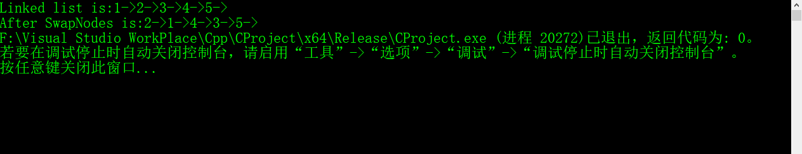
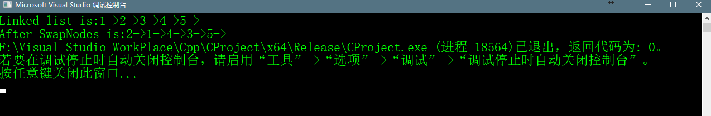

# Pairwise swap elements of a given linked list_19


## Abstract
>给定一个单链表，写一个方法，成对的交换两个元素，例如，如果Linked List是1->2->3->4->5，那么此方法则应该把Linked List变为
>2->1->4->3->5。如果Linked List是1->2->3->4->5->6，则应该变为2->1->4->3->6->5。

## 解决问题思路
>### 方法一：迭代法  
>从头到尾的遍历的Linked List，在遍历的同时将 每个节点的数据和该节点的下一个节点的数据 进行交换。这里选择数据交换，而不是节点的
>交换，这样简化了交换过程。具体的代码如下：

```c++
    //pairwise swap linked list 
    void swapNodesPairwise(Node * head_ref)
    {
    	struct Node* curr = head_ref;
    	while (curr != NULL && curr->next != NULL)
    	{
    		//swap the data and next node's data
    		int swapTemp = curr->next->data;
    		curr->next->data = curr->data;
    		curr->data = swapTemp;

    		//move 2 steps curr pointer
    		curr = curr->next->next;
    	}
    }
```
>整体代码如下：

```c++
    #include <cstdio>
    #include <iostream>
    #include <unordered_set>
    #include <cstdlib>

    //print LinkedList's content
    void printList(struct Node* n);
    //插入一个新节点在最前面
    void push(struct Node** head_ref, int new_data);
    //swap node pairwise
    void swapNodesPairwise(struct Node* head);

    struct Node
    {
    	int data;
    	struct Node *next;
    };


    int main() {

    	/* Start with the empty list */
    	struct Node* head = NULL;

    	/* Created linked list will be 1->2->3->4->5 */
    	
    	push(&head, 5);
    	push(&head, 4);
    	push(&head, 3);
    	push(&head, 2);
    	push(&head, 1);

    	printf("Linked list is:");
    	printList(head);
    	printf("\n");

    	swapNodesPairwise(head);
    	printf("After SwapNodes is:");
    	printList(head);

    	return 0;
    }


    //print linked list content
    void printList(struct Node* node) {
    	while (node != NULL)
    	{
    		printf("%d->", node->data);
    		node = node->next;
    	}
    }

    //add a new node in the head
    void push(struct Node** head_ref, int new_data) {
    	//1.allocate node
    	struct Node* new_node = (struct Node*)malloc(sizeof(struct Node));
    	//2. put in the data;
    	new_node->data = new_data;
    	//3.make next of new node as head
    	new_node->next = *head_ref;
    	//4.move the head to point to the new node;
    	*head_ref = new_node;
    }


    //pairwise swap linked list 
    void swapNodesPairwise(Node * head_ref)
    {
    	struct Node* curr = head_ref;
    	while (curr != NULL && curr->next != NULL)
    	{
    		//swap the data and next node's data
    		int swapTemp = curr->next->data;
    		curr->next->data = curr->data;
    		curr->data = swapTemp;

    		//move 2 steps curr pointer
    		curr = curr->next->next;
    	}
    }
```

## 代码运行效果




### 方法二
> 如果有2个或两个以上的节点在Linked List中，则我们可以使用递归方式。代码如下：

```c++
//recursive function to pairwise swap element of a linked list
void swapNodesPairwiseByRecursion(struct Node* head) {
	//there must be at-leas two nodes in the list
	if (head != NULL && head->next!= NULL) {
		//swap the node's data with data of the next node
		int swapData = head->next->data;
		head->next->data = head->data;
		head->data = swapData;
		//recursive call
		swapNodesPairwiseByRecursion(head->next->next);
	}
}
```
## 整体代码如下

```c++
    #include <cstdio>
    #include <iostream>
    #include <unordered_set>
    #include <cstdlib>

    //print LinkedList's content
    void printList(struct Node* n);
    //插入一个新节点在最前面
    void push(struct Node** head_ref, int new_data);
    //swap node pairwise
    void swapNodesPairwise(struct Node* head);
    //swap nodes pairwise by recursiond
    void swapNodesPairwiseByRecursion(struct Node* head);

    struct Node
    {
    	int data;
    	struct Node *next;
    };


    int main() {

    	/* Start with the empty list */
    	struct Node* head = NULL;

    	/* Created linked list will be 1->2->3->4->5 */
    	
    	push(&head, 5);
    	push(&head, 4);
    	push(&head, 3);
    	push(&head, 2);
    	push(&head, 1);

    	printf("Linked list is:");
    	printList(head);
    	printf("\n");

    	swapNodesPairwiseByRecursion(head);
    	printf("After SwapNodes is:");
    	printList(head);

    	return 0;
    }


    //print linked list content
    void printList(struct Node* node) {
    	while (node != NULL)
    	{
    		printf("%d->", node->data);
    		node = node->next;
    	}
    }

    //add a new node in the head
    void push(struct Node** head_ref, int new_data) {
    	//1.allocate node
    	struct Node* new_node = (struct Node*)malloc(sizeof(struct Node));
    	//2. put in the data;
    	new_node->data = new_data;
    	//3.make next of new node as head
    	new_node->next = *head_ref;
    	//4.move the head to point to the new node;
    	*head_ref = new_node;
    }

    //recursive function to pairwise swap element of a linked list
    void swapNodesPairwiseByRecursion(struct Node* head) {
    	//there must be at-leas two nodes in the list
    	if (head != NULL && head->next!= NULL) {
    		//swap the node's data with data of the next node
    		int swapData = head->next->data;
    		head->next->data = head->data;
    		head->data = swapData;
    		//recursive call
    		swapNodesPairwiseByRecursion(head->next->next);
    	}
    }
```

## 代码运行效果

