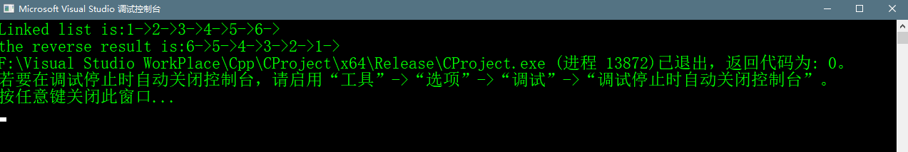

# Reverse Linked List


## Abstract
> 给定一个单链表的头结点指针，用于使整个单链表倒置。我们应该通过改变节点的方式逆置单链表
> 例如，1->2->3->4->NULL
> 倒置后链表为4->3->2->1->NULL


## 方法一 迭代法
> 1. 初始化三个指针，prev为NULL，curr指向头结点，next为NULL
> 2. 循环迭代所有的节点，并且在循环的过程里做下面的这些事  
> ① 在改变curr的下一个节点之前，先保存下一个节点  next = curr->next  
> ② 改变curr的下一个节点，这里是实际逆转发生的地方 curr->next = prev  
> ③ 将prev和curr向前一步 prev = curr，curr = next

## 迭代法的示意图


## 部分代码
```c++
    void reverse(Node ** head_ref)
    {
    	struct Node* prev = NULL;
    	struct Node* current = *head_ref;
    	struct Node* next;
    	while (current != NULL)
    	{ 
    		next = current->next;
    		current->next = prev;
    		prev = current;
    		current = next;
    	}
    	*head_ref = prev;
    }
```

## 完整代码
```c++
    #include <cstdio>
    #include <cstdlib>
    #include <iostream>

    using namespace std;

    //A linked list node

    //打印LinkedList
    void printList(struct Node* n);
    //插入一个新节点在最前面
    void push(struct Node** head_ref, int new_data);


    struct Node
    {
    	int data;
    	struct Node *next;
    };

    int main() {
    	push(&head1, 6);
    	push(&head1, 5);
    	push(&head1, 4);
    	push(&head1, 3);
    	push(&head1, 2);
    	push(&head1, 1);

    	printf("Linked list is:");
    	printList(head1);
    	printf("\n");

    	reverse(&head1);
    	printf("the reverse result is:");
    	printList(head1);
    }

    void reverse(Node ** head_ref)
    {
    	struct Node* prev = NULL;
    	struct Node* current = *head_ref;
    	struct Node* next;
    	while (current != NULL)
    	{
    		next = current->next;
    		current->next = prev;
    		prev = current;
    		current = next;
    	}
    	*head_ref = prev;
    }

    void push(struct Node** head_ref, int new_data) {
    	//1.allocate node
    	struct Node* new_node = (struct Node*)malloc(sizeof(struct Node));
    	//2. put in the data;
    	new_node->data = new_data;
    	//3.make next of new node as head
    	new_node->next = *head_ref;
    	//4.move the head to point to the new node;
    	*head_ref = new_node;
    }

    //打印链表的内容
    void printList(struct Node* node) {
    	while (node != NULL)
    	{
    		printf("%d->", node->data);
    		node = node->next;
    	}
    }
```

## 代码运行效果
