# 18 Swap nodes without swapping data 


## Abstract
> 给定两个一个Linked List和存在于Linked List中的两个值，应该交换节点，而不是节点中数据，因为当有很多值的情况下，如果此时交换节点可能花费比较  
> 昂贵的代价。可以先假设Linked List中的所有值都是不同的。
> 例如：
> 
    Input:  10->15->12->13->20->14,  x = 12, y = 20 
    Output: 10->15->20->13->12->14
    Input:  10->15->12->13->20->14,  x = 10, y = 20
    Output: 20->15->12->13->10->14
    Input:  10->15->12->13->20->14,  x = 12, y = 13
    Output: 10->15->13->12->20->14


> 这看起来似乎是一个很简单的问题，但是的有以下的几个问题要处理。在接下来的叙述中，用x和y表示要交换的两个元素。
> * x和y可能不是毗邻的两个元素
> * x和y俩者之中可能是头节点
> * x和y俩者之中可能是尾节点
> * x和y俩者之中可以不在Linked List中，也可能都不在。  
> 如何只用精简的代码优雅的解决上面那些可能出现问题。
> 完整代码如下：

```c++
    #include <cstdio>
    #include <iostream>
    #include <unordered_set>
    #include <cstdlib>

    //print LinkedList's content
    void printList(struct Node* n);
    //插入一个新节点在最前面
    void push(struct Node** head_ref, int new_data);
    //swap two nodes
    void swapTwoNodes(struct Node**,int,int);

    struct Node
    {
    	int data;
    	struct Node *next;
    };


    int main() {

    	/* Start with the empty list */
    	struct Node* head = NULL;

    	/* Let us create a sorted linked list to test the functions
    	 Created linked list will be 11->11->11->13->13->20 */
    	push(&head, 7);
    	push(&head, 6);
    	push(&head, 5);
    	push(&head, 4);
    	push(&head, 3);
    	push(&head, 2);
    	push(&head, 1);

    	printf("Linked list before :");
    	printList(head);
    	printf("\n");

    	swapTwoNodes(&head, 6, 2);


    	printf("\n");
    	printf("Linked list after :");
    	printList(head);

    	return 0;

    }

    //add a new node in the head
    void push(struct Node** head_ref, int new_data) {
    	//1.allocate node
    	struct Node* new_node = (struct Node*)malloc(sizeof(struct Node));
    	//2. put in the data;
    	new_node->data = new_data;
    	//3.make next of new node as head
    	new_node->next = *head_ref;
    	//4.move the head to point to the new node;
    	*head_ref = new_node;
    }

    //print linked list content
    void printList(struct Node* node) {
    	while (node != NULL)
    	{
    		printf("%d->", node->data);
    		node = node->next;
    	}
    }

    void swapTwoNodes(Node ** head_ref, int x, int y)
    {
    	//Nothing to do if x and y are same
    	if (x == y) {
    		std::cout << "the nodes are same!" << std::endl;
    		return;
    	}

    	//search for x(keep track previous of x )
    	struct Node *prevX = NULL, *currX = *head_ref;
    	//stop loop when currX is NULL and currX->data not equal x
    	//and record currX regard as prevX
    	while (currX && currX->data != x)
    	{
    		prevX = currX;
    		currX = currX->next;
    	}
    	//taverse y as long as traverse x
    	struct Node *prevY = NULL, *currY = *head_ref;
    	while (currY && currY->data != y)
    	{
    		prevY = currY;
    		currY = currY->next;
    	}

    	//if either x or y is not present,nothing to do 
    	if (currX == NULL || currY == NULL)
    	{
    		std::cout << "either x or y is not present!" << std::endl;
    		return;
    	}

    	//if prevX not equal NULL,it stand for the x is not head of Linked list
    	if (prevX != NULL)
    	{
    		prevX->next = currY;
    	}
    	else //else make y as new head
    	{
    		*head_ref = currY;
    	}

    	//like X
    	if (prevY != NULL)
    	{
    		prevY->next = currX;
    	}
    	else //else make x as new head
    	{
    		*head_ref = currX;
    	}

    	struct Node *temp = currY->next;
    	currY->next = currX->next;
    	currX->next = temp;
    }
```

## 分析:
## 画图解释如下

> ### 1.  初始化Linked List
> 
> 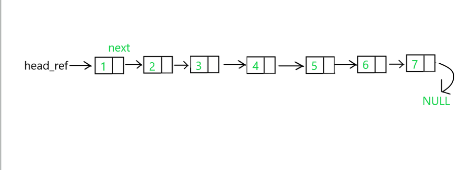


> ### 2.  进入swapTwoNodes(struct Node**,int,int)方法
> 先判断两个要找的节点的值是否相同。如果相同则打印提示信息然后返回。否则进入下一步。  
>这里是交换2,6两个节点，因为不相同，所以进入下一步骤。


> ### 3.  循环查找第一个数
> 第一个数为6  
> 定义prevX和currX两个指针变量。初始化时他们一个指向NULL，一个指向head_ref。
> 
> 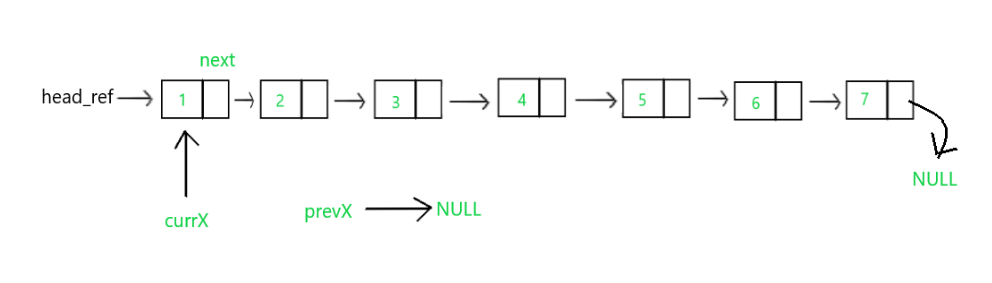
> ### 循环过程：
> #### ① 判断循环条件
>发现currX不为NULL且currX->data不等于传入的6  
>此时执行：
```c++
     prevX = currX;
     currX = currX->next;
```

> #### ②执行循环
>第一次执行循环的内容后此时指针的指向情况如下图：
>
>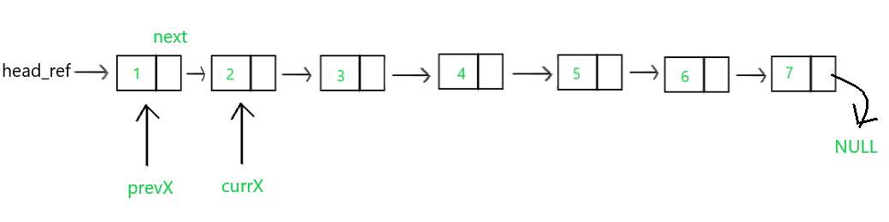


>第二次判断如果currX不为为NULL，并且currX->data不等于指定的x，此时执行循环内的语句，两个指针为以下状态：
>
>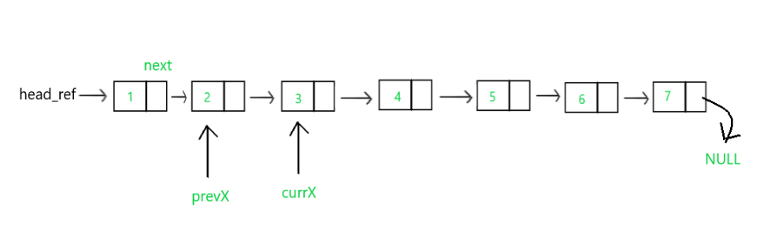

>第三次判断如果currX不为NULL，并且currX->data不等于指定的x，此时执行循环内的语句，两个指针为以下状态：
>
>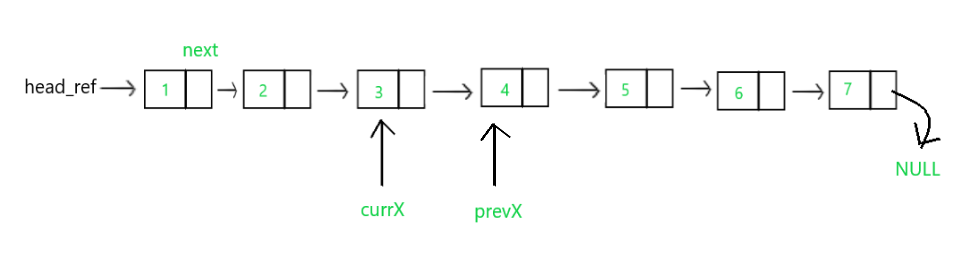


> 经过多次判断和循环之后，此时当currX为NULL或currX->data等于指定的x之后即退出循环  
> 此时的两个指针如下图所示：
> 
> 
> 
>如果此时指针currX指向的为NULL的时，那么说明当前要匹配的节点不在该Linked List中，  
>可以直接让函数返回或者给出提示。

>### 4.循环查找第二个数
>同理和currX一样，当执行到第二个循环之后，和上述的过程相差无几，此时指针的指向情况如下图所示：
>
>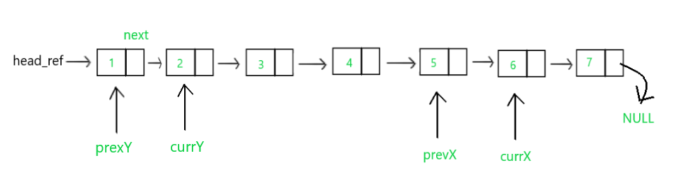
>
>同样的，如果此时指针currY指向的为NULL时，那么说明当前要查找的节点并不在此Linked List中，  
>让函数返回或给出提示。

> ### 5.判断currX与currY两个指针此时的指向情况
```c++
    if (currX == NULL || currY == NULL)
	{
		std::cout << "either x or y is not present!" << std::endl;
		return;
	}
```
>如果此时currX和currY两个指针此时的都为空NULL或任意一个为NULL，则如同前面所分析的那样：  
>表示此时要查找的两个数其中之一或两个都不在当前Linked List中。
>此时让退出函数给出提示。

>### 6.判断prevX的情况
>如果此时prexX不为NULL，则表示该指定的节点不为头节点。
>那么此时执行:  
```c++
    prevX->next = currY;
```
>此过程如下图所示：  
>#### ① 执行prevX->next = currY;
>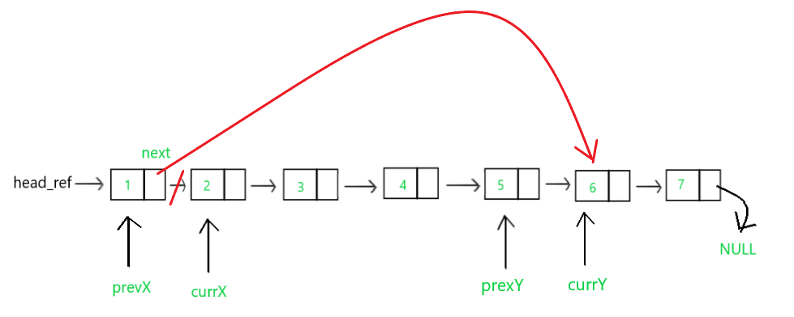
>#### ②执行else语句
>当prevX为NULL的时，此时表示该查找的X节点为头节点。此时只需要把头结点指向currY即可，如下图：
>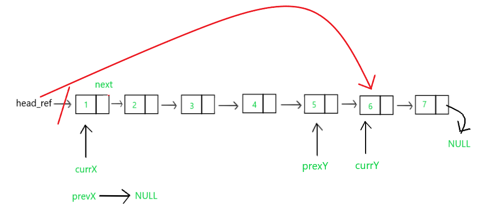

>### 7.判断prevY的情况
>#### ① if语句内
>同判断prevX的情况相同，当prevY不为NULL时，执行prevY->next = currX，即下图：
>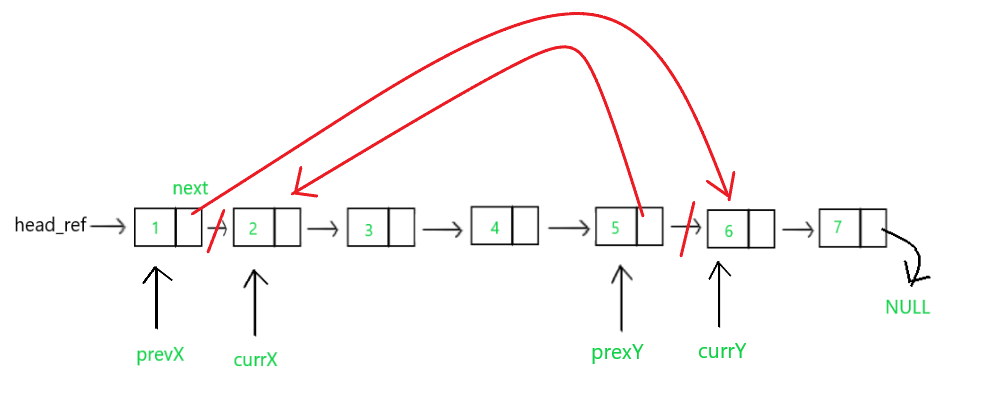
>#### ② else语句内
>当prevY为NULL时，则此时查找的Y节点为头结点(因为如果X，Y节点都为头结点，头结点只有一个，他们交换后不变，不容易用图来表示，所以这里主要解释的是两个都是不是头结点来说明。下图情况为一个为X为头结点，Y不为头结点的情况)
>
>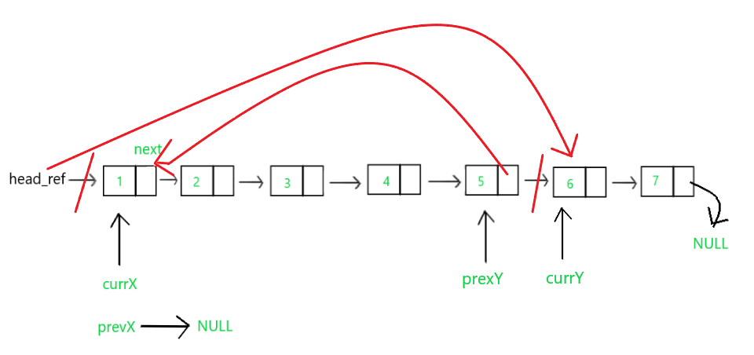

### 8.最后一步
```c++
    struct Node *temp = currY->next;
	currY->next = currX->next;
	currX->next = temp;
```
>此语句除了节点不在Linked List中的情况下，其他情况都会执行此语句。  
>过程如下图（这里以两个节点不为头节点为例）：
>#### ① 创建temp指针
>
>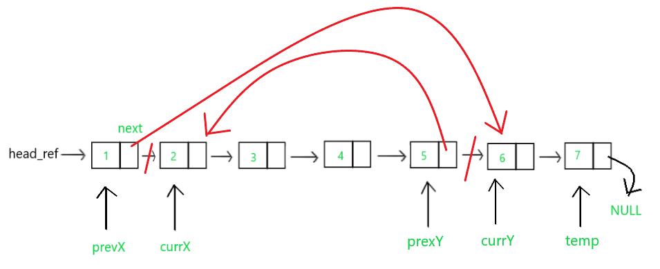
>#### ②把6的next指向3
>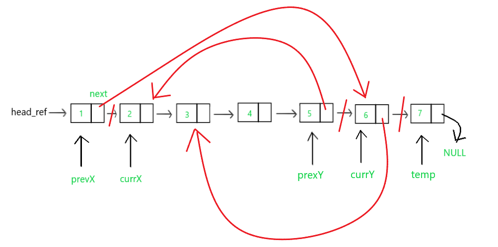
>#### ③ 把交换后的2的next指向原来6的next即temp
>如图：
>
>  
>以上步骤完成了指定俩个X,Y节点的交换。